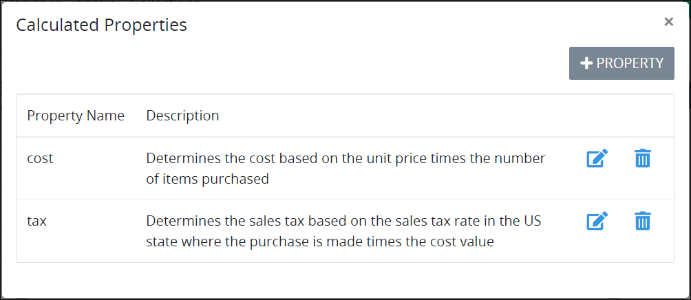
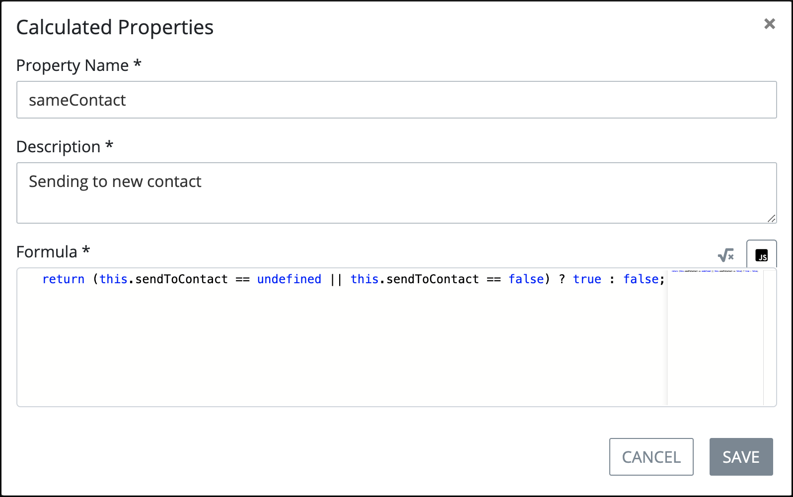

# Edit a Calculated Property for a Screen

## Edit a Calculated Property for a ProcessMaker Screen


### Permissions Required

Your user account or group membership must have the following permissions to edit a Calculated Property for a ProcesMaker Screen:

* Screens: Edit Screens
* Screens: View Screens

See the ProcessMaker [Screens](../../../../processmaker-administration/permission-descriptions-for-users-and-groups.md#screens) permissions or ask your ProcessMaker Administrator for assistance.


Follow these steps to edit a Calculated Property for a ProcessMaker Screen:

1. [Open](../../manage-forms/view-all-forms.md) the ProcessMaker Screen in which to add a Calculated Property. The ProcessMaker Screen is in [Design mode](../screens-builder-modes.md#editor-mode).
2. [View the Calculated Properties for that ProcessMaker Screen](view-computed-properties-for-a-screen.md#view-the-computed-properties-for-a-processmaker-screen). The **Computer Properties** screen displays all Calculated Properties for this ProcessMaker Screen. 
3. Click the **Edit** iconfor the Calculated Property to edit. The **Calculated Properties** screen displays that Calculated Property's name, description, and how its value is determined.  

   

4. Edit the following settings about the Calculated Property as necessary:
   * In the **Property Name** setting, edit the name of the Calculated Property. This Calculated Property name displays both in the **Calculated Properties** screen and in the JSON data model when previewing the ProcessMaker Screen. This is a required setting.
   * In the **Description** setting, edit the description of the Calculated Property. This is a required setting.
   * Above the **Formula** setting, select one of the following ways to determine how the Calculated Property determines its value:
     * **Mathematical calculation:** Click the **Formula** iconto enter the value, mathematical calculation, or formula that calculates the Calculated Property. The **Formula** icon is selected by default.
     * **JavaScript:**  
       Click the **JavaScript** iconto calculate the Calculated Property using valid JavaScript. By calculating the Calculated Property using JavaScript, you can reference the values for ProcessMaker Screen controls and ProcessMaker [Magic Variables](../../../reference-global-variables-in-your-processmaker-assets.md). Ensure to use valid JavaScript to calculate the Calculated Property by using a [`return` statement](https://www.w3schools.com/jsref/jsref_return.asp) to return the result of an expression \(the value\). Furthermore, ensure to use the [`this.` JavaScript keyword](https://www.w3schools.com/js/js_this.asp) preceding the ProcessMaker Screen control/Magic Variable reference. See the examples below.

       Follow these guidelines to reference ProcessMaker Screen control or Magic Variable values:

       * **Screen control value:**

         Reference a ProcessMaker Screen control's value by referencing that control's **Variable Value** setting. Example: `return  this.FullName` when `FullName` is the **Variable Value** setting value for the control to reference its value when the Calculated Property runs.

       * **Magic Variable value:**

         Reference a ProcessMaker Magic Variable's value. ProcessMaker uses a set of Magic Variables that become part of the JSON data model for all Requests. ProcessMaker uses these Magic Variables to store ProcessMaker user, Process, and Request related data for all Requests. During an in-progress Request, these ProcessMaker Magic Variables are updated. All ProcessMaker Magic Variables are preceded by an underscore \(`_`\) character in the JSON data model. Reference the ProcessMaker Magic Variable after the `this.` keyword. Example: `return  this._user.fullname` to reference the ProcessMaker user's full name from the in-progress Request. See [Magic Variable Descriptions](../../../reference-global-variables-in-your-processmaker-assets.md#global-variable-descriptions). Note that there is no ProcessMaker Magic Variable that stores the ProcessMaker user that starts a Request \(known as the requester\). To address this, use a Calculated Property to reference the `_user.fullname` Magic Variable's value in the ProcessMaker Screen referenced in the first [Task](../../../../using-processmaker/task-management/what-is-a-task.md) element of a Process; since many Processes are designed such that the requester is the ProcessMaker [user](../../../../processmaker-administration/add-users/what-is-a-user.md) assigned the first Task in a Request, this is a helpful way of storing who the requester is. This Calculated Property stores this Magic Variable's value, which you may reference elsewhere.
   * In the **Formula** setting, edit the mathematical calculation/JavaScript that determines the Calculated Property value. This is a required setting.
5. Click **Save**. The Property displays in the **Calculated Properties** screen. The following message displays: **Property Saved**.


Ensure to [save your ProcessMaker Screen](../save-a-screen.md#save-a-processmaker-screen). The Calculated Property is not edited until you save it. Doing so will save your work if that your [session expires](../../../../using-processmaker/session-timeout-warning.md#session-timeout-warning).


## Related Topics































