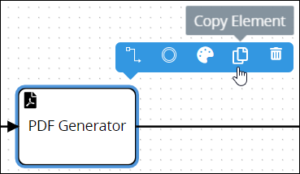
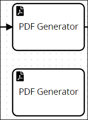
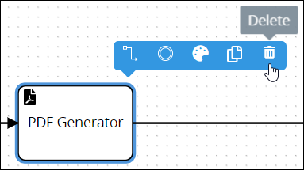

# PDF Generator Connector

## Overview

The PDF Generator [connector](../what-is-a-connector.md) is part of the [PDF Generator package](../../../../package-development-distribution/package-a-connector/pdf-generator-package.md) that can automatically generate PDFs of [Display](../../../design-forms/screens-builder/types-for-screens.md#display)-type [ProcessMaker Screens](../../../design-forms/what-is-a-form.md) during [Requests](../../../../using-processmaker/requests/what-is-a-request.md). Use the PDF Generator connector in your Process models when you want to provide a printable copy of a Display-type ProcessMaker Screen, such as for Request summaries or purchase order receipts.


### ProcessMaker Package Required

The PDF Generator connector requires that the [PDF Generator package](../../../../package-development-distribution/package-a-connector/pdf-generator-package.md) be installed in your ProcessMaker instance. The PDF Generator connector and the PDF Generator [package](../../../../package-development-distribution/first-topic.md) are not available in the ProcessMaker open-source edition. Contact [ProcessMaker Sales](https://www.processmaker.com/contact/) or ask your ProcessMaker sales representative how the PDF Generator connector can be installed in your ProcessMaker instance.


When the PDF Generator connector successfully generates the PDF during an in-progress Request, the PDF output can be downloaded from the [**Files** tab in its Request summary](../../../../using-processmaker/requests/request-details/summary-for-in-progress-requests.md#files-associated-with-the-request). The PDF Generator names the PDF output the same as the ProcessMaker Screen from which the PDF was generated. As long as the PDF Generator successfully generates the PDF, the PDF output remains available from that Request's summary regardless of that Request's status.

## Package and Permissions Required

The PDF Generator connector requires that the [ProcessMaker PDF Generator package](../../../../package-development-distribution/package-a-connector/pdf-generator-package.md) be installed in your ProcessMaker instance. The PDF Generator connector and the PDF Generator [package](../../../../package-development-distribution/first-topic.md) are not available in the ProcessMaker open-source edition. Contact [ProcessMaker Sales](https://www.processmaker.com/contact/) or ask your ProcessMaker sales representative how the PDF Generator connector can be installed in your ProcessMaker instance.

Furthermore, your ProcessMaker user account or group membership must have the following permissions to configure a PDF Generator connector to the Process model unless your user account has the **Make this user a Super Admin** setting selected:

* Processes: Edit Processes
* Processes: View Processes

See the [Process](../../../../processmaker-administration/permission-descriptions-for-users-and-groups.md#processes) permissions or ask your ProcessMaker Administrator for assistance.

## Add a PDF Generator Connector to the Process Model


[A package and permissions are required to do this](pdf-generator-connector.md#package-and-permissions-required).


Follow these steps to add a PDF Generator connector to the Process model:

1. [View your Processes](../../../viewing-processes/view-the-list-of-processes/view-your-processes.md#view-all-active-processes). The **Processes** page displays.
2. [Create a new Process](../../../viewing-processes/view-the-list-of-processes/create-a-process.md) or click the **Open Modeler** iconto edit the selected Process model. Process Modeler displays.
3. Locate the **PDF Generator** connector in the **Elements and Connectors** palette that is to the left of the Process Modeler canvas. If the [**Hide Menus** button](../../navigate-around-your-process-model.md#maximize-the-process-modeler-canvas-view)is enabled, the **Elements and Connectors** palette displays the **PDF Generator** connector's icon.  
4. Drag the connector into the Process model canvas where you want to place it. If a Pool element is in your Process model, the PDF Generator connector cannot be placed outside of the Pool element.


After adding the PDF Generator connector, consider adding the following Boundary-type Process model elements to design business solutions when your best-case scenarios don't happen:

* [Boundary Timer Event](../../model-your-process/add-and-configure-boundary-timer-event-elements.md#add-a-boundary-timer-event-element) element \([Don't know what that is?](../../model-your-process/process-modeling-element-descriptions.md#boundary-timer-event)\)
* [Boundary Error Event](../../model-your-process/add-and-configure-boundary-error-event-elements.md#add-a-boundary-error-event-element) element \([Don't know what that is?](../../model-your-process/process-modeling-element-descriptions.md#boundary-error-event)\)
* [Boundary Signal Event](../../model-your-process/add-and-configure-boundary-signal-event-elements.md) element \([Don't know what that is?](../../model-your-process/process-modeling-element-descriptions.md#boundary-signal-event)\)


After the PDF Generator connector is placed into the Process model, you may move it by dragging it to the new location.


Moving a PDF Generator connector has the following limitations in regards to the following Process model elements:

* **Pool element:** If the PDF Generator connector is inside of a [Pool](../../model-your-process/process-modeling-element-descriptions.md#pool) element, it cannot be moved outside of the Pool element. If you attempt to do so, Process Modeler places the PDF Generator connector inside the Pool element closest to where you attempt to move it.
* **Lane element:** If the PDF Generator connector is inside of a Lane element, it can be moved to another Lane element in the same Pool element. However, the PDF Generator connector cannot be moved outside of the Pool element.


## Copy a PDF Generator Connector

Copying a PDF Generator connector copies the original along with its current settings, making it easier and faster to continue designing without adding default elements or [connectors](../what-is-a-connector.md) with their default settings.

The copied PDF Generator connector displays below the original. Any [Sequence Flow](../../model-your-process/process-modeling-element-descriptions.md#sequence-flow) and/or [Message Flow](../../model-your-process/process-modeling-element-descriptions.md#message-flow) elements incoming to or outgoing from the original are not copied.


[A package and permissions are required to do this](pdf-generator-connector.md#package-and-permissions-required).


Follow these steps to copy a PDF Generator connector in your Process model:

1. ​[View your Processes](https://processmaker.gitbook.io/processmaker-4-community/-LPblkrcFWowWJ6HZdhC/~/drafts/-LRhVZm0ddxDcGGdN5ZN/primary/designing-processes/viewing-processes/view-the-list-of-processes/view-your-processes#view-all-processes). The **Processes** page displays.
2. Click the **Open Modeler** iconto edit the selected Process model. Process Modeler displays.
3. Select the PDF Generator connector to copy. Available options display above the selected connector.  
4. Click the **Copy Element** icon. The Process model connector copies.  

## Delete a PDF Generator Connector

Deleting a Process model [connector](../what-is-a-connector.md) also deletes any [Sequence Flow](../../model-your-process/process-modeling-element-descriptions.md#sequence-flow) and/or [Message Flow](../../model-your-process/process-modeling-element-descriptions.md#message-flow) elements incoming to or outgoing from that element. For example, if a Process model connector is deleted that has both incoming and outgoing Sequence Flow elements, the Sequence Flow elements must be reconnected for the remaining elements/connectors.


[A package and permissions are required to do this](pdf-generator-connector.md#package-and-permissions-required).


Follow these steps to delete a PDF Generator connector from your Process model:

1. ​[View your Processes](https://processmaker.gitbook.io/processmaker-4-community/-LPblkrcFWowWJ6HZdhC/~/drafts/-LRhVZm0ddxDcGGdN5ZN/primary/designing-processes/viewing-processes/view-the-list-of-processes/view-your-processes#view-all-processes). The **Processes** page displays.
2. Click the **Open Modeler** iconto edit the selected Process model. Process Modeler displays.
3. Select the PDF Generator connector to delete. Available options display above the selected connector.  
4. Click the **Delete** icon. The Process model connector deletes.

## Settings

The PDF Generator connector has the following panels that contain settings:

* **Configuration** panel
  * [Edit the connector name](pdf-generator-connector.md#edit-the-connector-name)
  * [Select the ProcessMaker Screen from which to generate a PDF](pdf-generator-connector.md#select-the-processmaker-screen-from-which-to-generate-a-pdf)

### Configuration Panel Settings

#### Edit the Connector Name


[A package and permissions are required to do this](pdf-generator-connector.md#package-and-permissions-required).


Follow these steps to configure a PDF Generator connector:

1. Ensure that the **Hide Menus** buttonis not enabled. See [Maximize the Process Modeler Canvas View](../../navigate-around-your-process-model.md#maximize-the-process-modeler-canvas-view).
2. Select the PDF Generator connector from the Process model in which to configure its settings. Panels to configure this connector display.
3. Expand the **Configuration** panel if it is not presently expanded. The **Name** setting displays. This is a required setting.  
4. In the **Name** setting, edit the selected connector's name and then press **Enter**.

#### Select the ProcessMaker Screen from Which to Generate a PDF


[A package and permissions are required to do this](pdf-generator-connector.md#package-and-permissions-required).


Follow these steps to select from which [Display](../../../design-forms/screens-builder/types-for-screens.md#display)-type [ProcessMaker Screen](../../../design-forms/what-is-a-form.md) to generate a PDF:

1. Ensure that the **Hide Menus** buttonis not enabled. See [Maximize the Process Modeler Canvas View](../../navigate-around-your-process-model.md#maximize-the-process-modeler-canvas-view).
2. Select the PDF Generator connector from the Process model in which to configure its settings. Panels to configure this connector display.
3. Expand the **Configuration** panel if it is not presently expanded, and then locate the **Select a Display Screen** setting.  
4. From the **Select a Display Screen** drop-down menu, select which ProcessMaker Screen to generate a PDF. Only Display-type ProcessMaker Screens display from this setting.

## Related Topics







