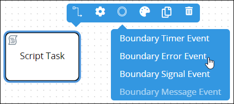
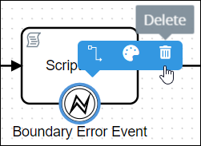

# Boundary Error Event Element

## Permissions Required


### Don't Know What a Boundary Error Event Element Is?

See [Process Modeling Element Descriptions](process-modeling-element-descriptions.md) for a description of the [Boundary Error Event](process-modeling-element-descriptions.md#boundary-error-event) element.


Your ProcessMaker user account or group membership must have the following permissions to configure a Boundary Error Event element in the Process model unless your user account has the **Make this user a Super Admin** setting selected:

* Processes: Edit Processes
* Processes: View Processes

See the [Process](../../../processmaker-administration/permission-descriptions-for-users-and-groups.md#processes) permissions or ask your ProcessMaker Administrator for assistance.

## Add a Boundary Error Event Element


[Permissions are required to do this](add-and-configure-boundary-error-event-elements.md#permissions-required).


Follow these steps to add a Boundary Error Event element to the Process model:

1. [View your Processes](../../viewing-processes/view-the-list-of-processes/view-your-processes.md#view-all-active-processes). The **Processes** page displays.
2. [Create a new Process](../../viewing-processes/view-the-list-of-processes/create-a-process.md) or click the **Open Modeler** iconto edit the selected Process model. Process Modeler displays.
3. Add one of the following Process model elements or [connectors](../model-processes-using-connectors/what-is-a-connector.md) to your Process model in which to associate with the Boundary Error Event element:
   * [Form Task](process-modeling-element-descriptions.md#form-task) element
   * [Manual Task](add-and-configure-manual-task-elements.md#add-a-manual-task-element) element
   * [Script Task](add-and-configure-script-task-elements.md#add-a-script-task-element) element
   * [Sub Process](add-and-configure-sub-process-elements.md#add-a-sub-process-element) element
   * [Actions By Email](../model-processes-using-connectors/available-connectors-from-processmaker/actions-by-email-connector.md) connector \(requires the [Actions By Email package](../../../package-development-distribution/package-a-connector/actions-by-email-package.md)\)
   * [Data Connector](../model-processes-using-connectors/available-connectors-from-processmaker/data-connector-connector.md) connector \(requires the [Data Connector package](../../../package-development-distribution/package-a-connector/data-connector-package.md)\)
   * [PDF Generator](../model-processes-using-connectors/available-connectors-from-processmaker/pdf-generator-connector.md) connector \(requires the [PDF Generator package](../../../package-development-distribution/package-a-connector/pdf-generator-package.md)\)
   * [Send Email](../model-processes-using-connectors/available-connectors-from-processmaker/email-connector.md) connector \(requires the [Send Email package](../../../package-development-distribution/package-a-connector/email.md)\)
4. From the **Boundary Events** drop-down menu, select the **Boundary Error Event** option. The Boundary Error Event element displays on the top of its associating element/connector.  

After placing the Boundary Error Event element, you may drag it to an adjacent side of its associating element/connector. Since Process Modeler displays labels at the bottom of Process model elements and connectors, the Boundary Error Event element displays best at the bottom of its associating element.

## Delete a Boundary Error Event Element


[Permissions are required to do this](add-and-configure-boundary-error-event-elements.md#permissions-required).


Follow these steps to delete a Boundary Error Event element from your Process model:

1. ​[View your Processes](https://processmaker.gitbook.io/processmaker-4-community/-LPblkrcFWowWJ6HZdhC/~/drafts/-LRhVZm0ddxDcGGdN5ZN/primary/designing-processes/viewing-processes/view-the-list-of-processes/view-your-processes#view-all-processes). The **Processes** page displays.
2. Click the **Open Modeler** iconto edit the selected Process model. Process Modeler displays.
3. Select the Boundary Error Event element to delete. Available options display above the selected element.  
4. Click the **Delete** icon. The Process model element deletes.

## Settings

The Boundary Error Event element has the following panels that contain settings:

* **Configuration** panel
  * [Edit the element name](add-and-configure-boundary-error-event-elements.md#edit-the-element-name)
* **Advanced** panel
  * [Edit the element's identifier value](add-and-configure-boundary-error-event-elements.md#edit-the-elements-identifier-value)

### Configuration Panel Settings

#### Edit the Element Name

An element name is a human-readable reference for a Process element. Process Modeler automatically assigns the name of a Process element with its element type. However, an element's name can be changed.


[Permissions are required to do this](add-and-configure-boundary-error-event-elements.md#permissions-required).


Follow these steps to edit the name for a Boundary Timer Event element:

1. Ensure that the **Hide Menus** buttonis not enabled. See [Maximize the Process Modeler Canvas View](../navigate-around-your-process-model.md#maximize-the-process-modeler-canvas-view).
2. Select the Boundary Error Event element from the Process model in which to edit its name. Panels to configure this element display.
3. Expand the **Configuration** panel if it is not presently expanded. The **Name** setting displays. This is a required setting.  
4. In the **Name** setting, edit the selected element's name and then press **Enter**.

### Advanced Panel Settings

#### Edit the Element's Identifier Value

Process Modeler automatically assigns a unique value to each Process element added to a Process model. However, an element's identifier value can be changed if it is unique to all other elements in the Process model, including the Process model's identifier value.


[Permissions are required to do this](add-and-configure-boundary-error-event-elements.md#permissions-required).



All identifier values for all elements in the Process model must be unique.


Follow these steps to edit the identifier value for a Boundary Error Event element:

1. Ensure that the **Hide Menus** buttonis not enabled. See [Maximize the Process Modeler Canvas View](../navigate-around-your-process-model.md#maximize-the-process-modeler-canvas-view).
2. Select the Boundary Error Event element from the Process model in which to edit its identifier value. Panels to configure this element display.
3. Expand the **Advanced** panel if it is not presently expanded. The **Node Identifier** setting displays. This is a required setting.  
4. In the **Node Identifier** setting, edit the Boundary Error Event element's identifier to a unique value from all elements in the Process model and then press **Enter**.

## Related Topics











