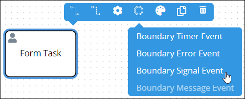
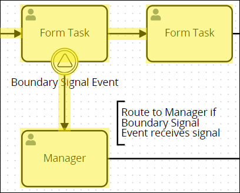
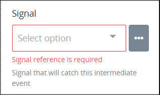
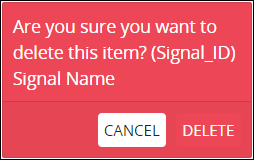
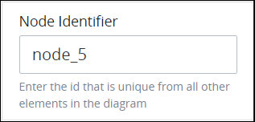

# Boundary Signal Event Element

## Permissions Required


### Don't Know What a Boundary Signal Event Element Is?

See [Process Modeling Element Descriptions](process-modeling-element-descriptions.md) for a description of the [Boundary Signal Event](process-modeling-element-descriptions.md#boundary-signal-event) element.


Your ProcessMaker user account or group membership must have the following permissions to configure a Boundary Signal Event element in the Process model unless your user account has the **Make this user a Super Admin** setting selected:

* Processes: Edit Processes
* Processes: View Processes

See the [Process](../../../processmaker-administration/permission-descriptions-for-users-and-groups.md#processes) permissions or ask your ProcessMaker Administrator for assistance.

## Add a Boundary Signal Event Element


[Permissions are required to do this](add-and-configure-boundary-signal-event-elements.md#permissions-required).


Follow these steps to add a Boundary Signal Event element to the Process model:

1. [View your Processes](../../viewing-processes/view-the-list-of-processes/view-your-processes.md#view-all-active-processes). The **Processes** page displays.
2. [Create a new Process](../../viewing-processes/view-the-list-of-processes/create-a-process.md) or click the **Open Modeler** iconto edit the selected Process model. Process Modeler displays.
3. Add one of the following Process model elements or [connectors](../model-processes-using-connectors/what-is-a-connector.md) to your Process model in which to associate with the Boundary Signal Event element:
   * [Form Task](process-modeling-element-descriptions.md#form-task) element
   * [Manual Task](add-and-configure-manual-task-elements.md#add-a-manual-task-element) element
   * [Script Task](add-and-configure-script-task-elements.md#add-a-script-task-element) element
   * [Sub Process](add-and-configure-sub-process-elements.md#add-a-sub-process-element) element
   * [Actions By Email](../model-processes-using-connectors/available-connectors-from-processmaker/actions-by-email-connector.md) connector \(requires the [Actions By Email package](../../../package-development-distribution/package-a-connector/actions-by-email-package.md)\)
   * [Data Connector](../model-processes-using-connectors/available-connectors-from-processmaker/data-connector-connector.md) connector \(requires the [Data Connector package](../../../package-development-distribution/package-a-connector/data-connector-package.md)\)
   * [PDF Generator](../model-processes-using-connectors/available-connectors-from-processmaker/pdf-generator-connector.md) connector \(requires the [PDF Generator package](../../../package-development-distribution/package-a-connector/pdf-generator-package.md)\)
   * [Send Email](../model-processes-using-connectors/available-connectors-from-processmaker/email-connector.md) connector \(requires the [Send Email package](../../../package-development-distribution/package-a-connector/email.md)\)
4. From the **Boundary Events** drop-down menu, select the **Boundary Signal Event** option. The Boundary Signal Event element displays on the top of its associating element/connector.  

After placing the Boundary Signal Event element, you may drag it to an adjacent side of its associating element/connector. Since Process Modeler displays labels at the bottom of Process model elements and connectors, the Boundary Signal Event element displays best at the bottom of its associating element.

## Delete a Boundary Signal Event Element


[Permissions are required to do this](add-and-configure-boundary-signal-event-elements.md#permissions-required).


Follow these steps to delete a Boundary Signal Event element from your Process model:

1. ​[View your Processes](https://processmaker.gitbook.io/processmaker-4-community/-LPblkrcFWowWJ6HZdhC/~/drafts/-LRhVZm0ddxDcGGdN5ZN/primary/designing-processes/viewing-processes/view-the-list-of-processes/view-your-processes#view-all-processes). The **Processes** page displays.
2. Click the **Open Modeler** iconto edit the selected Process model. Process Modeler displays.
3. Select the Boundary Signal Event element to delete. Available options display above the selected element.  
4. Click the **Delete** icon. The Process model element deletes.

## Settings

The Boundary Signal Event element has the following panels that contain settings:

* **Configuration** panel
  * [Edit the element name](add-and-configure-boundary-signal-event-elements.md#edit-the-element-name)
  * [Indicate to interrupt the best-case scenario workflow](add-and-configure-boundary-signal-event-elements.md#indicate-to-interrupt-the-best-case-scenario-workflow)
  * [Select the signal to trigger the element](add-and-configure-boundary-signal-event-elements.md#select-the-signal-to-trigger-the-element)
  * [Edit the name of a signal](add-and-configure-boundary-signal-event-elements.md#edit-the-name-of-a-signal)
  * [Delete a signal from the ProcessMaker instance](add-and-configure-boundary-signal-event-elements.md#delete-a-signal-from-the-processmaker-instance)
* **Advanced** panel
  * [Edit the element's identifier value](add-and-configure-boundary-signal-event-elements.md#edit-the-elements-identifier-value)

### Configuration Panel Settings

#### Edit the Element Name

An element name is a human-readable reference for a Process element. Process Modeler automatically assigns the name of a Process element with its element type. However, an element's name can be changed.


[Permissions are required to do this](add-and-configure-boundary-signal-event-elements.md#permissions-required).


Follow these steps to edit the name for a Boundary Signal Event element:

1. Ensure that the **Hide Menus** buttonis not enabled. See [Maximize the Process Modeler Canvas View](../navigate-around-your-process-model.md#maximize-the-process-modeler-canvas-view).
2. Select the Boundary Signal Event element from the Process model in which to edit its name. Panels to configure this element display.
3. Expand the **Configuration** panel if it is not presently expanded. The **Name** setting displays. This is a required setting.  
4. In the **Name** setting, edit the selected element's name and then press **Enter**.

#### Indicate to Interrupt the Best-Case Scenario Workflow

Indicate whether the Boundary Signal Event element interrupts the best-case scenario workflow:

* **Interrupting workflow:** When workflow routes through the Boundary Signal Event element, workflow is interrupted and does not route through the best-case scenario. As highlighted in the example below, workflow routes through the Boundary Signal Event element if the Boundary Signal Event element receives the specific broadcast signal for which it is listening if the Manual Task element is not complete when receiving that signal.  
* **Non-interrupting workflow:** Workflow routes both through the Boundary Signal Event element and the best-case scenario, thereby creating parallel workflow in that Request. As highlighted in the example below, workflow routes through the Boundary Signal Event element if the Manual Task element is not yet complete; however, workflow also routes through the best-case scenario when that element completes.  


[Permissions are required to do this](add-and-configure-boundary-signal-event-elements.md#permissions-required).


Follow these steps to indicate if this Boundary Signal Event element interrupts the best-case scenario workflow when it triggers:

1. Ensure that the **Hide Menus** buttonis not enabled. See [Maximize the Process Modeler Canvas View](../navigate-around-your-process-model.md#maximize-the-process-modeler-canvas-view).
2. Select the Boundary Signal Event element from the Process model in which to indicate if it interrupts the best-case scenario workflow. Panels to configure this element display.
3. Expand the **Configuration** panel if it is not presently expanded, and then locate the **Interrupting** setting.  
4. From the **Interrupting** checkbox, indicate whether this Boundary Signal Event element interrupts the best-case scenario workflow when it triggers. When the **Interrupting** checkbox is selected, which is the default setting, this element interrupts the best-case scenario workflow.

#### Select the Signal to Trigger the Element

A Boundary Signal Event element represents alternate workflow routing when that element receives a specific broadcast signal. The element that broadcasts the signal does not need to be in the same Process model as the Boundary Signal Event element to receive the broadcast signal. Use a Boundary Signal Event element to design business solutions when alternate workflow must occur simultaneously across multiple Process Requests when a separate element in a separate Request broadcasts a signal for which any or all Boundary Signal Event elements is listening. Select the signal that triggers this element.

You may create a signal from this setting. This signal becomes available throughout your ProcessMaker instance for all Process designers to use after you [save your Process model](../toolboxes.md#save-your-process-model). Therefore, the attributes that define a signal, the signal ID and signal name, must be unique.

However, ensure to configure one of the following elements from any Process model to broadcast this signal when it triggers; otherwise, the signal you create from this setting never broadcasts during any Request:

* [Intermediate Signal Throw Event](process-modeling-element-descriptions.md#intermediate-signal-throw-event) element
* [Signal End Event](process-modeling-element-descriptions.md#signal-end-event) element


[Permissions are required to do this](add-and-configure-boundary-signal-event-elements.md#permissions-required).


Follow these steps to select the signal that triggers the Boundary Signal Event element:

1. Ensure that the **Hide Menus** buttonis not enabled. See [Maximize the Process Modeler Canvas View](../navigate-around-your-process-model.md#maximize-the-process-modeler-canvas-view).
2. Select the Boundary Signal Event element from the Process model in which to select the signal that triggers it. Panels to configure this element display.
3. Expand the **Configuration** panel if it is not presently expanded, and then locate the **Signal** setting.  
4. Do one of the following:
   * **The signal to trigger this element exists:**
     1. From the **Signal** drop-down menu, select the signal that triggers this element. This setting is required.
   * **The signal to trigger this element does not exist:**
     1. Click the menu iconbeside the **Signal** drop-down menu. The **+Signal** button displays.
     2. Click the **+Signal** button. The **ID** and **Name** settings display to configure the new signal's ID and name, respectively.  
     3. In the **ID** setting, enter the unique ID of this signal. The signal ID may only contain non-special characters and without spaces. This signal ID must be unique from all other signal IDs in this ProcessMaker instance. If the entered signal ID already exists, the following text displays below the setting: **Signal ID is duplicated**. Note that the signal ID cannot be edited after the signal is created. This is a required setting.
     4. In the **Name** setting, enter the unique alphanumeric name of this signal. This signal name must be unique from all other signal names in this ProcessMaker instance. This signal name displays when selecting a signal from other elements that can broadcast or listen for a signal. If the entered signal name already exists, the following text displays below the setting: **Signal Name is duplicated**. This is a required setting.
     5. Click **Save**. The signal is created.
     6. From the **Signal** drop-down menu, select the new signal that triggers this element. This setting is required.

#### Edit the Name of a Signal

Editing the name of a signal changes that signal's name in your ProcessMaker instance. This signal name displays when selecting a signal from other elements that can broadcast or listen for a signal.


[Permissions are required to do this](add-and-configure-boundary-signal-event-elements.md#permissions-required).


Follow these steps to edit the name of a signal:

1. Ensure that the **Hide Menus** buttonis not enabled. See [Maximize the Process Modeler Canvas View](../navigate-around-your-process-model.md#maximize-the-process-modeler-canvas-view).
2. Select any element from the Process model that broadcasts or listens for a signal. Panels to configure this element display.
3. Expand the **Configuration** panel if it is not presently expanded, and then locate the **Signal** setting. The **Signal** setting may have a selection unlike the image below indicates.  
4. Click the menu iconbeside the **Signal** drop-down menu. All signals configured in your ProcessMaker instance display below the **+Signal** button. The signal ID displays in a gray border; the signal name displays to the right of the signal ID.  
5. Click the **Edit** iconthat displays beside each signal to edit that signal. The **Name** setting displays the name of that signal.  
6. In the **Name** setting, edit the name of the signal as necessary.
7. Click **Save**.
8. [Save your Process model](../toolboxes.md#save-your-process-model).

#### Delete a Signal from the ProcessMaker Instance


[Permissions are required to do this](add-and-configure-boundary-signal-event-elements.md#permissions-required).



Carefully consider whether to delete a signal. Deleting a signal makes that signal unavailable when configuring all elements that broadcast or listen to signals throughout your ProcessMaker instance. However, those elements already configured with a deleted signal are not affected, nor are any started Requests affected.

Deleting a signal from the ProcessMaker instance cannot be undone.


Follow these steps to delete a signal from the ProcessMaker instance:

1. Ensure that the **Hide Menus** buttonis not enabled. See [Maximize the Process Modeler Canvas View](../navigate-around-your-process-model.md#maximize-the-process-modeler-canvas-view).
2. Select any element from the Process model that broadcasts or listens for a signal. Panels to configure this element display.
3. Expand the **Configuration** panel if it is not presently expanded, and then locate the **Signal** setting. The **Signal** setting may have a selection unlike the image below indicates.  
4. Click the menu iconbeside the **Signal** drop-down menu. All signals configured in your ProcessMaker instance display below the **+Signal** button. The signal ID displays in a gray border; the signal name displays to the right of the signal ID.  
5. Click the **Delete** iconthat displays beside each signal to delete that signal. A message displays to confirm deletion of this signal.  
6. Click **Delete**.
7. [Save your Process model](../toolboxes.md#save-your-process-model).

### Advanced Panel Settings

#### Edit the Element's Identifier Value

Process Modeler automatically assigns a unique value to each Process element added to a Process model. However, an element's identifier value can be changed if it is unique to all other elements in the Process model, including the Process model's identifier value.


[Permissions are required to do this](add-and-configure-boundary-signal-event-elements.md#permissions-required).



All identifier values for all elements in the Process model must be unique.


Follow these steps to edit the identifier value for a Boundary Signal Event element:

1. Ensure that the **Hide Menus** buttonis not enabled. See [Maximize the Process Modeler Canvas View](../navigate-around-your-process-model.md#maximize-the-process-modeler-canvas-view).
2. Select the Boundary Signal Event element from the Process model in which to edit its identifier value. Panels to configure this element display.
3. Expand the **Advanced** panel if it is not presently expanded. The **Node Identifier** setting displays. This is a required setting.  
4. In the **Node Identifier** setting, edit the Boundary Signal Event element's identifier to a unique value from all elements in the Process model and then press **Enter**.

## Related Topics









