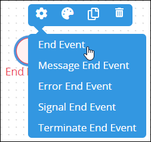
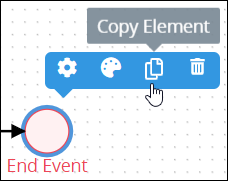
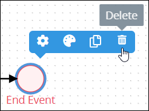

# End Event Element

## Permissions Required


### Don't Know What an End Event Element Is?

See [Process Modeling Element Descriptions](process-modeling-element-descriptions.md) for a description of the [End Event](process-modeling-element-descriptions.md#end-event) element.


Your ProcessMaker user account or group membership must have the following permissions to configure an End Event element in the Process model unless your user account has the **Make this user a Super Admin** setting selected:

* Processes: Edit Processes
* Processes: View Processes

See the [Process](../../../processmaker-administration/permission-descriptions-for-users-and-groups.md#processes) permissions or ask your ProcessMaker Administrator for assistance.

## Add an End Event Element


[Permissions are required to do this](add-and-configure-end-event-elements.md#permissions-required).


Follow these steps to add an End Event element to the Process model:

1. [View your Processes](../../viewing-processes/view-the-list-of-processes/view-your-processes.md#view-all-active-processes). The **Processes** page displays.
2. [Create a new Process](../../viewing-processes/view-the-list-of-processes/create-a-process.md) or click the **Open Modeler** iconto edit the selected Process model. Process Modeler displays.
3. Locate the **End Event** element in the **Elements and Connectors** palette that is to the left of the Process Modeler canvas. If the [**Hide Menus** button](../navigate-around-your-process-model.md#maximize-the-process-modeler-canvas-view)is enabled, the **Elements and Connectors** palette displays the **End Event** element's icon.

   

4. Drag the element into the Process model canvas where you want to place it. If a Pool element is in your Process model, the End Event element cannot be placed outside of the Pool element.
5. Do one of the following:
   * From the **Elements** drop-down menu, select the **End Event** option.  
   * Click anywhere in the Process model. The End Event element selects by default.

After the element is placed into the Process model, you may move it by dragging it to the new location.


Moving an End Event element has the following limitations in regards to the following Process model elements:

* **Pool element:** If the End Event element is inside of a [Pool](process-modeling-element-descriptions.md#pool) element, it cannot be moved outside of the Pool element. If you attempt to do so, Process Modeler places the End Event element inside the Pool element closest to where you attempt to move it.
* **Lane element:** If the End Event element is inside of a Lane element, it can be moved to another Lane element in the same Pool element. However, the End Event element cannot be moved outside of the Pool element.


## Copy an End Event Element

Copying an End Event element copies the original along with its current settings, making it easier and faster to continue designing without adding default elements or [connectors](../model-processes-using-connectors/what-is-a-connector.md) with their default settings.

The copied End Event element displays below the original. Any [Sequence Flow](process-modeling-element-descriptions.md#sequence-flow) and/or [Message Flow](process-modeling-element-descriptions.md#message-flow) elements incoming to or outgoing from the original are not copied.


[Permissions are required to do this](add-and-configure-end-event-elements.md#permissions-required).


Follow these steps to copy an End Event element in your Process model:

1. ​[View your Processes](https://processmaker.gitbook.io/processmaker-4-community/-LPblkrcFWowWJ6HZdhC/~/drafts/-LRhVZm0ddxDcGGdN5ZN/primary/designing-processes/viewing-processes/view-the-list-of-processes/view-your-processes#view-all-processes). The **Processes** page displays.
2. Click the **Open Modeler** iconto edit the selected Process model. Process Modeler displays.
3. Select the End Event element to copy. Available options display above the selected element.  
4. Click the **Copy Element** icon. The Process model element copies.  

## Delete an End Event Element

Deleting a Process model element also deletes any [Sequence Flow](process-modeling-element-descriptions.md#sequence-flow) and/or [Message Flow](process-modeling-element-descriptions.md#message-flow) elements incoming to or outgoing from that element. For example, if a Process model element is deleted that has both incoming and outgoing Sequence Flow elements, the Sequence Flow elements must be reconnected for the remaining elements/[connectors](../model-processes-using-connectors/what-is-a-connector.md).


[Permissions are required to do this](add-and-configure-end-event-elements.md#permissions-required).


Follow these steps to delete an End Event element from your Process model:

1. ​[View your Processes](https://processmaker.gitbook.io/processmaker-4-community/-LPblkrcFWowWJ6HZdhC/~/drafts/-LRhVZm0ddxDcGGdN5ZN/primary/designing-processes/viewing-processes/view-the-list-of-processes/view-your-processes#view-all-processes). The **Processes** page displays.
2. Click the **Open Modeler** iconto edit the selected Process model. Process Modeler displays.
3. Select the End Event element or connector to delete. Available options display above the selected element.  
4. Click the **Delete** icon. The Process model element deletes.

## Settings

The End Event element has the following panels that contain settings:

* **Configuration** panel
  * [Edit the element name](add-and-configure-end-event-elements.md#edit-the-element-name)
  * [Select the ProcessMaker Screen that summarizes a completed Request](add-and-configure-end-event-elements.md#select-the-processmaker-screen-that-summarizes-a-completed-request)
* **Advanced** panel
  * [Edit the element's identifier value](add-and-configure-end-event-elements.md#edit-the-elements-identifier-value)

### Configuration Panel Settings

#### Edit the Element Name

An element name is a human-readable reference for a Process element. Process Modeler automatically assigns the name of a Process element with its element type. However, an element's name can be changed.


[Permissions are required to do this](add-and-configure-end-event-elements.md#permissions-required).


Follow these steps to edit the name for an End Event element:

1. Ensure that the **Hide Menus** buttonis not enabled. See [Maximize the Process Modeler Canvas View](../navigate-around-your-process-model.md#maximize-the-process-modeler-canvas-view).
2. Select the End Event element from the Process model in which to edit its name. Panels to configure this element display.
3. Expand the **Configuration** panel if it is not presently expanded. The **Name** setting displays. This is a required setting.  

   

4. In the **Name** setting, edit the selected element's name and then press **Enter**.

#### Select the ProcessMaker Screen That Summarizes a Completed Request

After a [Request](../../../using-processmaker/requests/what-is-a-request.md) completes when an End Event element triggers, a [ProcessMaker Screen](../../design-forms/what-is-a-form.md) can display a summary of the completed Request. If a Process model has multiple End Event elements, then each End Event element can reference a different ProcessMaker Screen to display a different summary.

For example, if an End Event element triggers from Lane 1 of a Pool element, then use a different ProcessMaker Screen to display the Request summary than an End Event element that triggers from Lane 2.

When an End Event element is placed into a Process model, it is not configured to display a summary ProcessMaker Screen when it triggers. Therefore, it must be configured.


[Permissions are required to do this](add-and-configure-end-event-elements.md#permissions-required).


Follow these steps to select the ProcessMaker Screen that displays when an End Event element triggers:

1. Ensure that the **Hide Menus** buttonis not enabled. See [Maximize the Process Modeler Canvas View](../navigate-around-your-process-model.md#maximize-the-process-modeler-canvas-view).
2. Select the End Event element from the Process model in which to select the ProcessMaker Screen that displays when that End Event element is triggered, thereby completing that Request. Panels to configure this element display.
3. Expand the **Configuration** panel if it is not presently expanded, and then locate the **Summary screen** setting.  

   

4. From the **Summary screen** drop-down menu, select the ProcessMaker Screen that has been designed to display Request summaries if that End Event element triggers. This drop-down menu displays only [Display](../../design-forms/screens-builder/types-for-screens.md#display)-type ProcessMaker Screens to display a message to the Request participant. Note that another End Event element located elsewhere in the Process model, such as another [Pool](process-modeling-element-descriptions.md#pool) or [Lane](process-modeling-element-descriptions.md#lane) element, may reference a different ProcessMaker Screen to display Request summaries when it triggers.

### Advanced Panel Settings

#### Edit the Element's Identifier Value

Process Modeler automatically assigns a unique value to each Process element added to a Process model. However, an element's identifier value can be changed if it is unique to all other elements in the Process model, including the Process model's identifier value.


[Permissions are required to do this](add-and-configure-end-event-elements.md#permissions-required).



All identifier values for all elements in the Process model must be unique.


Follow these steps to edit the identifier value for an End Event element:

1. Ensure that the **Hide Menus** buttonis not enabled. See [Maximize the Process Modeler Canvas View](../navigate-around-your-process-model.md#maximize-the-process-modeler-canvas-view).
2. Select the End Event element from the Process model in which to edit its identifier value. Panels to configure this element display.
3. Expand the **Advanced** panel if it is not presently expanded. The **Node Identifier** setting displays. This is a required setting.  

   

4. In the **Node Identifier** setting, edit the End Event element's identifier to a unique value from all elements in the Process model and then press **Enter**.

## Related Topics











