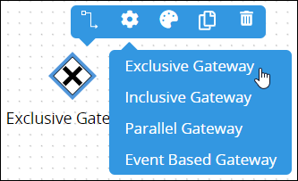

# Exclusive Gateway Elements

## Permissions Required


### Don't Know What an Exclusive Gateway Element Is?

See [Process Modeling Element Descriptions](process-modeling-element-descriptions.md) for a description of the [Exclusive Gateway](process-modeling-element-descriptions.md#exclusive-gateway) element.


Your ProcessMaker user account or group membership must have the following permissions to configure a Exclusive Gateway element in the Process model unless your user account has the **Make this user a Super Admin** setting selected:

* Processes: Edit Processes
* Processes: View Processes

See the [Process](../../../processmaker-administration/permission-descriptions-for-users-and-groups.md#processes) permissions or ask your ProcessMaker Administrator for assistance.

## Add an Exclusive Gateway Element


[Permissions are required to do this](add-and-configure-exclusive-gateway-elements.md#permissions-required).


Follow these steps to add an Exclusive Gateway element to the Process model:

1. [View your Processes](../../viewing-processes/view-the-list-of-processes/view-your-processes.md#view-all-active-processes). The **Processes** page displays.
2. [Create a new Process](../../viewing-processes/view-the-list-of-processes/create-a-process.md) or click the **Open Modeler** iconto edit the selected Process model. Process Modeler displays.
3. Locate the **Gateway** element in the **Elements and Connectors** palette that is to the left of the Process Modeler canvas. If the [**Hide Menus** button](../navigate-around-your-process-model.md#maximize-the-process-modeler-canvas-view)is enabled, the **Elements and Connectors** palette displays the **Gateway** element's icon.  
4. Drag the element into the Process model canvas where you want to place it. If a Pool element is in your Process model, the Exclusive Gateway element cannot be placed outside of the Pool element.
5. Do one of the following:
   * From the **Elements** drop-down menu, select the **Exclusive Gateway** option.  
   * Click anywhere in the Process model. The Exclusive Gateway element selects by default.

After the element is placed into the Process model, you may move it by dragging it to the new location.


Moving an Exclusive Gateway element has the following limitations in regards to the following Process model elements:

* **Pool element:** If the Exclusive Gateway element is inside of a [Pool](process-modeling-element-descriptions.md#pool) element, it cannot be moved outside of the Pool element. If you attempt to do so, Process Modeler places the Exclusive Gateway element inside the Pool element closest to where you attempt to move it.
* **Lane element:** If the Exclusive Gateway element is inside of a Lane element, it can be moved to another Lane element in the same Pool element. However, the Exclusive Gateway element cannot be moved outside of the Pool element.


## Delete an Exclusive Gateway Element

Deleting a Process model element also deletes any [Sequence Flow](process-modeling-element-descriptions.md#sequence-flow) and/or [Message Flow](process-modeling-element-descriptions.md#message-flow) elements incoming to or outgoing from that element. For example, if a Process model element is deleted that has both incoming and outgoing Sequence Flow elements, the Sequence Flow elements must be reconnected for the remaining elements/[connectors](../model-processes-using-connectors/what-is-a-connector.md).


[Permissions are required to do this](add-and-configure-exclusive-gateway-elements.md#permissions-required).


Follow these steps to delete an Exclusive Gateway element from your Process model:

1. ​[View your Processes](https://processmaker.gitbook.io/processmaker-4-community/-LPblkrcFWowWJ6HZdhC/~/drafts/-LRhVZm0ddxDcGGdN5ZN/primary/designing-processes/viewing-processes/view-the-list-of-processes/view-your-processes#view-all-processes). The **Processes** page displays.
2. Click the **Open Modeler** iconto edit the selected Process model. Process Modeler displays.
3. Select the Exclusive Gateway element to delete. Available options display above the selected element.  
4. Click the **Delete** icon. The Process model element deletes.

## Settings

The Exclusive Gateway element has the following panels that contain settings:

* **Configuration** panel
  * [Edit the element name](add-and-configure-exclusive-gateway-elements.md#edit-the-element-name)
* **Advanced** panel
  * [Edit the element's identifier value](add-and-configure-exclusive-gateway-elements.md#edit-the-elements-identifier-value)

### Configuration Panel Settings

#### Edit the Element Name

An element name is a human-readable reference for a Process element. Process Modeler automatically assigns the name of a Process element with its element type. However, an element's name can be changed.


[Permissions are required to do this](add-and-configure-exclusive-gateway-elements.md#permissions-required).


Follow these steps to edit the name for an Exclusive Gateway element:

1. Ensure that the **Hide Menus** buttonis not enabled. See [Maximize the Process Modeler Canvas View](../navigate-around-your-process-model.md#maximize-the-process-modeler-canvas-view).
2. Select the Exclusive Gateway element from the Process model in which to edit its name. Panels to configure this element display.
3. Expand the **Configuration** panel if it is not presently expanded. The **Name** setting displays. This is a required setting. 
4. In the **Name** setting, edit the selected element's name and then press **Enter**.

### Advanced Panel Settings

#### Edit the Element's Identifier Value

Process Modeler automatically assigns a unique value to each Process element added to a Process model. However, an element's identifier value can be changed if it is unique to all other elements in the Process model, including the Process model's identifier value.


[Permissions are required to do this](add-and-configure-exclusive-gateway-elements.md#permissions-required).



All identifier values for all elements in the Process model must be unique.


Follow these steps to edit the identifier value for an Exclusive Gateway element:

1. Ensure that the **Hide Menus** buttonis not enabled. See [Maximize the Process Modeler Canvas View](../navigate-around-your-process-model.md#maximize-the-process-modeler-canvas-view).
2. Select the Exclusive Gateway element from the Process model in which to edit its identifier value. Panels to configure this element display.
3. Expand the **Advanced** panel if it is not presently expanded. The **Node Identifier** setting displays. This is a required setting. 
4. In the **Node Identifier** setting, edit the Exclusive Gateway element's identifier to a unique value from all elements in the Process model and then press **Enter**.

## Related Topics









