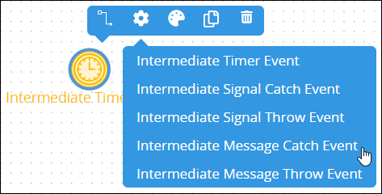
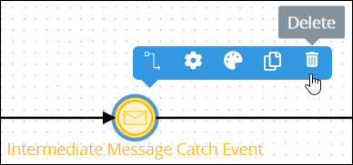

# Intermediate Message Catch Event Element

## Permissions Required


### Don't Know What an Intermediate Message Catch Event Element Is?

See [Process Modeling Element Descriptions](process-modeling-element-descriptions.md) for a description of the [Intermediate Message Catch Event](process-modeling-element-descriptions.md#intermediate-message-catch-event) element.


Your ProcessMaker user account or group membership must have the following permissions to configure an Intermediate Message Catch Event element in the Process model unless your user account has the **Make this user a Super Admin** setting selected:

* Processes: Edit Processes
* Processes: View Processes

See the [Process](../../../processmaker-administration/permission-descriptions-for-users-and-groups.md#processes) permissions or ask your ProcessMaker Administrator for assistance.

## Add an Intermediate Message Catch Event Element


[Permissions are required to do this](add-and-configure-intermediate-message-catch-event-elements.md#permissions-required).


Follow these steps to add an Intermediate Message Catch Event element to the Process model:

1. [View your Processes](../../viewing-processes/view-the-list-of-processes/view-your-processes.md#view-all-active-processes). The **Processes** page displays.
2. [Create a new Process](../../viewing-processes/view-the-list-of-processes/create-a-process.md) or click the **Open Modeler** iconto edit the selected Process model. Process Modeler displays.
3. Locate the **Intermediate Event** element in the **Elements and Connectors** palette that is to the left of the Process Modeler canvas. If the [**Hide Menus** button](../navigate-around-your-process-model.md#maximize-the-process-modeler-canvas-view)is enabled, the **Elements and Connectors** palette displays the **Intermediate Event** element's icon.  
4. Drag the element into the Process model canvas where you want to place it. If a Pool element is in your Process model, the Intermediate Message Catch Event element cannot be placed outside of the Pool element.
5. From the **Elements** drop-down menu, select the **Intermediate Message Catch Event** option. The Intermediate Message Catch Event element displays.  

After the element is placed into the Process model, you may move it by dragging it to the new location.


Moving an Intermediate Message Catch Event element has the following limitations in regards to the following Process model elements:

* **Pool element:** If the Intermediate Message Catch Event element is inside of a [Pool](process-modeling-element-descriptions.md#pool) element, it cannot be moved outside of the Pool element. If you attempt to do so, Process Modeler places the Intermediate Message Catch Event element inside the Pool element closest to where you attempt to move it.
* **Lane element:** If the Intermediate Message Catch Event element is inside of a Lane element, it can be moved to another Lane element in the same Pool element. However, the Intermediate Message Catch Event element cannot be moved outside of the Pool element.


## Delete an Intermediate Message Catch Event Element

Deleting a Process model element also deletes any [Sequence Flow](process-modeling-element-descriptions.md#sequence-flow) and/or [Message Flow](process-modeling-element-descriptions.md#message-flow) elements incoming to or outgoing from that element. For example, if a Process model element is deleted that has both incoming and outgoing Sequence Flow elements, the Sequence Flow elements must be reconnected for the remaining elements/[connectors](../model-processes-using-connectors/what-is-a-connector.md).


[Permissions are required to do this](add-and-configure-intermediate-message-catch-event-elements.md#permissions-required).


Follow these steps to delete an Intermediate Message Catch Event element from your Process model:

1. ​[View your Processes](https://processmaker.gitbook.io/processmaker-4-community/-LPblkrcFWowWJ6HZdhC/~/drafts/-LRhVZm0ddxDcGGdN5ZN/primary/designing-processes/viewing-processes/view-the-list-of-processes/view-your-processes#view-all-processes). The **Processes** page displays.
2. Click the **Open Modeler** iconto edit the selected Process model. Process Modeler displays.
3. Select the Intermediate Message Catch Event element to delete. Available options display above the selected element.  
4. Click the **Delete** icon. The Process model element deletes.

## Settings

The Intermediate Message Catch Event element has the following panels that contain settings:

* **Configuration** panel
  * [Edit the element name](add-and-configure-intermediate-message-catch-event-elements.md#edit-the-element-name)
  * [Select the element from which to listen for a message](add-and-configure-intermediate-message-catch-event-elements.md#select-the-element-from-which-to-listen-for-a-message)
* **Vocabularies** panel \(available when the [Vocabularies package](../../../package-development-distribution/package-a-connector/vocabularies.md) is installed\)
  * [Assign ProcessMaker Vocabularies that validate Request data from this element](add-and-configure-intermediate-message-catch-event-elements.md#assign-processmaker-vocabularies-that-validate-request-data-from-this-element)
* **Advanced** panel
  * [Edit the element's identifier value](add-and-configure-intermediate-message-catch-event-elements.md#edit-the-elements-identifier-value)

### Configuration Panel Settings

#### Edit the Element Name

An element name is a human-readable reference for a Process element. Process Modeler automatically assigns the name of a Process element with its element type. However, an element's name can be changed.


[Permissions are required to do this](add-and-configure-intermediate-message-catch-event-elements.md#permissions-required).


Follow these steps to edit the name for an Intermediate Message Catch Event element:

1. Ensure that the **Hide Menus** buttonis not enabled. See [Maximize the Process Modeler Canvas View](../navigate-around-your-process-model.md#maximize-the-process-modeler-canvas-view).
2. Select the Intermediate Message Catch Event element from the Process model in which to edit its name. Panels to configure this element display.
3. Expand the **Configuration** panel if it is not presently expanded. The **Name** setting displays. This is a required setting.  

   

4. In the **Name** setting, edit the selected element's name and then press **Enter**.

#### Select the Element from Which to Listen for a Message

An Intermediate Message Catch Event element pauses a [Request](../../../using-processmaker/requests/what-is-a-request.md) until that element receives a message from either an [Intermediate Message Throw Event](process-modeling-element-descriptions.md#intermediate-message-throw-event) element or a [Message End Event](process-modeling-element-descriptions.md#message-end-event) element \(but not both\) located in a different [Pool](process-modeling-element-descriptions.md#pool) element than the Intermediate Message Catch Event element receiving the message. After the Intermediate Message Catch Event element receives its message, that element triggers. Select from which element to listen for a message based on the Intermediate Message Throw Event or Message End Event element's **Message Name** setting value.


[Permissions are required to do this](add-and-configure-intermediate-message-catch-event-elements.md#permissions-required).


Follow these steps to select the element from which to listen for a message:

1. Ensure that the **Hide Menus** buttonis not enabled. See [Maximize the Process Modeler Canvas View](../navigate-around-your-process-model.md#maximize-the-process-modeler-canvas-view).
2. Select the Intermediate Message Catch Event element from the Process model in which to configure how it is triggered. Panels to configure this element display.
3. Expand the **Configuration** panel if it is not presently expanded, and then locate the **Listen For Message** setting.  
4. From the **Listen For Message** drop-down menu, select from which Intermediate Message Throw Event element or End Event element triggers the Intermediate Message Catch Event element.

### Vocabularies Panel Settings

#### Assign ProcessMaker Vocabularies That Validate Request Data from This Element

Assign [ProcessMaker Vocabularies](../../vocabularies-management/what-is-a-vocabulary.md) that validate Request data complies with a specific JSON schema. This is often mandatory for many types of business sectors including banking and healthcare. Ensure the quality and compliance of Request data. For example, during a Loan Application process, ensure that personal information has been included in the Request to that moment in that in-progress Request. The Vocabularies package must be installed in your ProcessMaker instance to make this configuration.

Use a ProcessMaker Vocabulary on an Intermediate Message Catch Event element to validate Request data complies with the Vocabulary's JSON schema. See [What is a Vocabulary?](../../vocabularies-management/what-is-a-vocabulary.md) for more information.

Each moment ProcessMaker evaluates workflow routing for an in-progress Request, ProcessMaker also evaluates the Request data's conformity to the ProcessMaker Vocabularies applied to the Process and/or a specific BPMN 2.0 element in the Process model. The Request's JSON data model must conform to the ProcessMaker Vocabulary's JSON schema.

During an in-progress Request, if ProcessMaker evaluates that the Request data no longer complies with all ProcessMaker Vocabularies to that moment, the Request status changes from In Progress to Error. The error displays in the [Request summary](../../../using-processmaker/requests/request-details/summary-for-requests-with-errors.md). ProcessMaker Vocabularies are cumulative in an in-progress Request: as the Request progresses, if Request data does not conform with any Vocabulary's JSON schema to that moment in the Request, the Request errors.

If no ProcessMaker Vocabularies are assigned, ProcessMaker does not validate Request data complies with a specific JSON schema prior to continuing workflow for that Request.

One or more ProcessMaker Vocabularies must be created to your ProcessMaker instance before assigning a Vocabulary. See [Create a New Vocabulary](../../vocabularies-management/manage-your-vocabularies/create-a-new-vocabulary.md#create-a-new-processmaker-vocabulary). Multiple ProcessMaker Vocabularies can be assigned to a Start Event element.


### ProcessMaker Package Required

Your ProcessMaker instance must have the [Vocabularies package](../../../package-development-distribution/package-a-connector/vocabularies.md) installed to assign which ProcessMaker Vocabularies validate Request data at an Intermediate Message Catch Event element. Use the Vocabularies package to maintain uniform JSON schemas across all assets in your organization. These assets include [Processes](../../viewing-processes/what-is-a-process.md), [ProcessMaker Screens](../../design-forms/what-is-a-form.md), and [ProcessMaker Scripts](../../scripts/what-is-a-script.md).

A ProcessMaker Vocabulary is a JSON schema. The JSON schema describes the data objects, types, and structure that you want in both a machine and human readable format. Apply one or more ProcessMaker Vocabularies to your Processes and/or specific BPMN 2.0 elements in your Process models to ensure the JSON data model in Request data complies with the data structure outlined in the JSON schema that you need to meet regulatory specifications or ensure Request data contains required information.

The Vocabularies package is not available in the ProcessMaker open-source edition. Contact [ProcessMaker Sales](mailto:sales@processmaker.com) or ask your ProcessMaker sales representative how the Vocabularies package can be installed in your ProcessMaker instance.



[Permissions are required to do this](add-and-configure-intermediate-message-catch-event-elements.md#permissions-required).


Follow these steps to assign ProcessMaker Vocabularies that validate Request data from an Intermediate Message Catch Event element:

1. Ensure that the **Hide Menus** buttonis not enabled. See [Maximize the Process Modeler Canvas View](../navigate-around-your-process-model.md#maximize-the-process-modeler-canvas-view).
2. Select the Intermediate Message Catch Event element from the Process model in which to assign ProcessMaker Vocabularies that validate Request data prior to when this element completes. Panels to configure this element display.
3. Expand the **Vocabularies** panel if it is not presently expanded. The **Assigned** setting displays.
4. Click theicon to add a ProcessMaker Vocabulary. The **Assign Vocabulary** option displays.  
5. From the **Select Vocabulary** drop-down menu, select a ProcessMaker Vocabulary from which to validate Request data complies with its JSON schema.

   If no ProcessMaker Vocabularies are configured in your ProcessMaker instance, then the following message displays: **List is empty.** Create at least one ProcessMaker Vocabulary. See [Create a New Vocabulary](../../vocabularies-management/manage-your-vocabularies/create-a-new-vocabulary.md#create-a-new-processmaker-vocabulary).

6. Click **Save**.
7. Repeat Steps 3 through 6 as necessary for each ProcessMaker Vocabulary required to validate Request data complies with its JSON schema.


Click the **Remove** iconfrom the **Vocabularies** setting to remove a ProcessMaker Vocabulary from assignment to this element.


After one or more ProcessMaker Vocabularies are assigned to an Intermediate Message Catch Event element, the Vocabulary icon displays above that element.

### Advanced Panel Settings

#### Edit the Element's Identifier Value

Process Modeler automatically assigns a unique value to each Process element added to a Process model. However, an element's identifier value can be changed if it is unique to all other elements in the Process model, including the Process model's identifier value.


[Permissions are required to do this](add-and-configure-intermediate-message-catch-event-elements.md#permissions-required).



All identifier values for all elements in the Process model must be unique.


Follow these steps to edit the identifier value for an Intermediate Message Catch Event element:

1. Ensure that the **Hide Menus** buttonis not enabled. See [Maximize the Process Modeler Canvas View](../navigate-around-your-process-model.md#maximize-the-process-modeler-canvas-view).
2. Select the Intermediate Message Catch Event element from the Process model in which to edit its identifier value. Panels to configure this element display.
3. Expand the **Advanced** panel if it is not presently expanded. The **Node Identifier** setting displays. This is a required setting.  

   

4. In the **Node Identifier** setting, edit the Intermediate Message Catch Event element's identifier to a unique value from all elements in the Process model and then press **Enter**.

## Related Topics



















