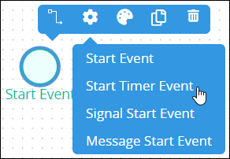
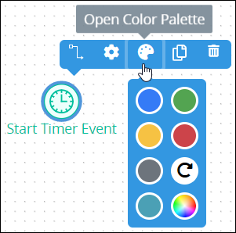
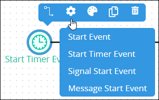
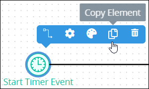
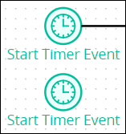
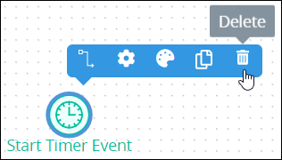

# Start Timer Event Element

## Permissions Required


### Don't Know What a Start Timer Event Element Is?

See [Process Modeling Element Descriptions](process-modeling-element-descriptions.md) for a description of the [Start Timer Event](process-modeling-element-descriptions.md#start-timer-event) element.


Your ProcessMaker user account or group membership must have the following permissions to configure a Start Timer Event element in the Process model unless your user account has the **Make this user a Super Admin** setting selected:

* Processes: Edit Processes
* Processes: View Processes

See the [Process](../../../processmaker-administration/permission-descriptions-for-users-and-groups.md#processes) permissions or ask your ProcessMaker Administrator for assistance.

## Add a Start Timer Event Element


[Permissions are required to do this.](add-and-configure-start-timer-event-elements.md#permissions-required)


Follow these steps to add a Start Timer Event element to the Process model:

1. [View your Processes](../../viewing-processes/view-the-list-of-processes/view-your-processes.md#view-all-active-processes). The **Processes** page displays.
2. [Create a new Process](../../viewing-processes/view-the-list-of-processes/create-a-process.md) or click the **Open Modeler** iconto edit the selected Process model. Process Modeler displays.
3. Locate the **Start Event** element in the **Elements and Connectors** palette that is to the left of the Process Modeler canvas. If the [**Hide Menus** button](../navigate-around-your-process-model.md#maximize-the-process-modeler-canvas-view)is enabled, the **Elements and Connectors** palette displays the **Start Event** element's icon.

   

4. Drag the element into the Process model canvas where you want to place it. If a Pool element is in your Process model, the Start Timer Event element cannot be placed outside of the Pool element.
5. From the **Elements** drop-down menu, select the **Start Timer Event** option. The Start Timer Event element displays.  

After the element is placed into the Process model, you may adjust its location in the following ways:

* Move the element by dragging it to a new location.
* [Select the element with other elements and/or connectors](../select-multiple-process-model-elements-and-connectors.md#select-multiple-process-model-objects), and then move them collectively by dragging them to new locations in relation to one another.
* [Align](../align-and-distribute-process-model-elements-and-connectors.md#align-process-model-objects) and/or [distribute](../align-and-distribute-process-model-elements-and-connectors.md#distribute-process-model-objects) the element in relation to other selected elements and/or [connectors](../model-processes-using-connectors/what-is-a-connector.md).


Moving a Start Timer Event element has the following limitations in regards to the following Process model elements:

* **Pool element:** If the Start Timer Event element is inside of a [Pool](process-modeling-element-descriptions.md#pool) element, it cannot be moved outside of the Pool element. If you attempt to do so, Process Modeler places the Start Timer Event element inside the Pool element closest to where you attempt to move it.
* **Lane element:** If the Start Timer Event element is inside of a Lane element, it can be moved to another Lane element in the same Pool element. However, the Start Timer Event element cannot be moved outside of the Pool element.


## Change the Color of a Start Timer Event Element

The Start Timer Event element and label have a default green color to indicate that this element is a starting [Request](../../../using-processmaker/requests/what-is-a-request.md) event. After a Start Timer Event element is [added to a Process model](add-and-configure-start-timer-event-elements.md#add-a-start-timer-event-element), its shape and label color can be changed. Element and [connector](../model-processes-using-connectors/what-is-a-connector.md) colors may only be changed individually.


[Permissions are required to do this](add-and-configure-start-timer-event-elements.md#permissions-required).


Follow these steps to change the color and label for a Start Timer Event element:

1. [View your Processes](https://processmaker.gitbook.io/processmaker-4-community/-LPblkrcFWowWJ6HZdhC/~/drafts/-LRhVZm0ddxDcGGdN5ZN/primary/designing-processes/viewing-processes/view-the-list-of-processes/view-your-processes#view-all-processes). The **Processes** page displays.
2. Click the **Open Modeler** iconto edit the selected Process model. Process Modeler displays.
3. Select the Start Timer Event element to change its color. Available options display above the selected element.  
4. Click the **Open Color Palette** icon. The color palette displays.
5. Do one of the following:
   * **Select a color swatch:** Select one of the color swatches from the color palette. The Start Timer Event element and label change to that color.
   * **Specify a custom color:** Click theicon to display the color selector, and then select a color, enter the [Hex color code](https://www.color-hex.com/), or enter the red, green, blue, and alpha color values for the custom color. The Start Timer Event element and label change to that color.  
   * **Reset to the default color:** Click theicon to reset the Start Timer Event element and label to its default color.

## Change to a Different Starting Request Event Element

After a Start Timer Event element is [added to a Process model](add-and-configure-start-timer-event-elements.md#add-a-start-timer-event-element), you may replace it with a different starting [Request](../../../using-processmaker/requests/what-is-a-request.md) event element:

* [Start Event](process-modeling-element-descriptions.md#start-event) element
* [Signal Start Event](process-modeling-element-descriptions.md#signal-start-event) element
* [Message Start Event](process-modeling-element-descriptions.md#message-start-event) element

Changing to another starting Request event element replaces the selected Start Timer Event element with the default settings and color for the replacing element.


[Permissions are required to do this](add-and-configure-start-timer-event-elements.md#permissions-required).


Follow these steps to change a Start Timer Event element to a different starting Request event element:

1. ​[View your Processes](https://processmaker.gitbook.io/processmaker-4-community/-LPblkrcFWowWJ6HZdhC/~/drafts/-LRhVZm0ddxDcGGdN5ZN/primary/designing-processes/viewing-processes/view-the-list-of-processes/view-your-processes#view-all-processes). The **Processes** page displays.
2. Click the **Open Modeler** iconto edit the selected Process model. Process Modeler displays.
3. Select the Start Timer Event element to change to another starting Request event element. Available options display above the selected element.
4. Click the **Elements** icon. The **Elements** drop-down menu displays the starting Request event elements.  
5. Select the element to replace the Start Timer Event element. The **Change Type** screen displays to confirm replacing the currently selected element.  
6. Click **Confirm**. The new element replaces the Start Timer Event element with its default settings and color.

## Copy a Start Timer Event Element

Copying a Start Timer Event element copies the original along with its current settings, making it easier and faster to continue designing without adding default elements or [connectors](../model-processes-using-connectors/what-is-a-connector.md) with their default settings.

The copied Start Timer Event element displays below the original. Any [Sequence Flow](process-modeling-element-descriptions.md#sequence-flow) and/or [Message Flow](process-modeling-element-descriptions.md#message-flow) elements incoming to or outgoing from the original are not copied.


[Permissions are required to do this](add-and-configure-start-timer-event-elements.md#permissions-required).


Follow these steps to copy a Start Timer Event element in your Process model:

1. ​[View your Processes](https://processmaker.gitbook.io/processmaker-4-community/-LPblkrcFWowWJ6HZdhC/~/drafts/-LRhVZm0ddxDcGGdN5ZN/primary/designing-processes/viewing-processes/view-the-list-of-processes/view-your-processes#view-all-processes). The **Processes** page displays.
2. Click the **Open Modeler** iconto edit the selected Process model. Process Modeler displays.
3. Select the Start Timer Event element to copy. Available options display above the selected element.  
4. Click the **Copy Element** icon. The Process model element copies.  

## Delete a Start Timer Event Element

Deleting a Process model element also deletes any [Sequence Flow](process-modeling-element-descriptions.md#sequence-flow) and/or [Message Flow](process-modeling-element-descriptions.md#message-flow) elements incoming to or outgoing from that element. For example, if a Process model element is deleted that has both incoming and outgoing Sequence Flow elements, the Sequence Flow elements must be reconnected for the remaining elements/[connectors](../model-processes-using-connectors/what-is-a-connector.md).


[Permissions are required to do this.](add-and-configure-start-timer-event-elements.md#permissions-required)


Follow these steps to delete a Start Timer Event element from your Process model:

1. ​[View your Processes](https://processmaker.gitbook.io/processmaker-4-community/-LPblkrcFWowWJ6HZdhC/~/drafts/-LRhVZm0ddxDcGGdN5ZN/primary/designing-processes/viewing-processes/view-the-list-of-processes/view-your-processes#view-all-processes). The **Processes** page displays.
2. Click the **Open Modeler** iconto edit the selected Process model. Process Modeler displays.
3. Select the Start Timer Event element to delete. Available options display above the selected element.  
4. Click the **Delete** icon. The Process model element deletes.

## Settings

The Start Timer Event element has the following panels that contain settings:

* **Configuration** panel
  * [Edit the element name](add-and-configure-start-timer-event-elements.md#edit-the-element-name)
* **Timing Control** panel
  * [Set the timing controls](add-and-configure-start-timer-event-elements.md#set-the-timing-controls)
* **Advanced** panel
  * [Edit the element's identifier value](add-and-configure-start-timer-event-elements.md#edit-the-elements-identifier-value)

### Configuration Panel Settings

#### Edit the Element Name

An element name is a human-readable reference for a Process element. Process Modeler automatically assigns the name of a Process element with its element type. However, an element's name can be changed.


[Permissions are required to do this.](add-and-configure-start-timer-event-elements.md#permissions-required)


Follow these steps to edit the name for a Start Timer Event element:

1. Ensure that the **Hide Menus** buttonis not enabled. See [Maximize the Process Modeler Canvas View](../navigate-around-your-process-model.md#maximize-the-process-modeler-canvas-view).
2. Select the Start Timer Event element from the Process model in which to edit its name. Panels to configure this element display.
3. Expand the **Configuration** panel if it is not presently expanded. The **Name** setting displays. This is a required setting.  
4. In the **Name** setting, edit the selected element's name and then press **Enter**.

### Timing Control Panel Settings

#### Set the Timing Controls

When a Start Timer Event element is placed into a Process model, it has the following settings by default before it triggers:

* The timing control is set to midnight of the current date.
* The timing control is set to repeat weekly on the current day.

If these are not the timing control settings you want, the Start Timer Event element must be configured. Set the timer controls for a Start Timer Event element using the following parameters:

* Set the date and hour when the trigger the Start Timer Event element, thereby starting a [Request](../../../using-processmaker/requests/what-is-a-request.md).
* Optionally, set an interval from which to periodically trigger the Start Time Event element, thereby staring a Request at that interval. This may be done in any of the following intervals:
  * Set the timer to periodically trigger on a specified number of days, weeks, months, or years.
  * Set the timer to periodically trigger on specific days of the week.
* Set when the timer control ends from any of the following options, thereby limiting when to start a Request:
  * The timer never ends.
  * The timer ends on a specified date.
  * The timer ends after a number of occurrences.


[Permissions are required to do this.](add-and-configure-start-timer-event-elements.md#permissions-required)


Follow these steps to set the timer controls for a Start Timer Event element:

1. Ensure that the **Hide Menus** buttonis not enabled. See [Maximize the Process Modeler Canvas View](../navigate-around-your-process-model.md#maximize-the-process-modeler-canvas-view).
2. Select the Start Timer Event element from the Process model in which to set its timer controls. Panels to configure this element display.
3. Expand the **Timing Control** panel if it is not presently expanded. The **Start date** setting displays.

   

4. From the **Start date** setting, use the date control to select the date to initially trigger the Start Timer Event element. If this setting has not been previously set, the current date is the default.  

   

5. Set the periodic interval to trigger the Start Timer Event element again, thereby starting a new Request. Follow these guidelines:
   * From the **Repeat every** setting, select at how many intervals of a set time period to trigger the Start Timer Event element. **1 week** is the default setting. Then select one of the following time periods for that element to trigger:
     * Day
     * Week \(default setting\)
     * Month
     * Year
   * Alternatively, select from the **Repeat on** setting the day\(s\) of the week in which to trigger the Start Timer Event element. Selected days display with a blue-colored circle around each.
6. Set when to end the timer control from the following options:
   * Select **Never** to never end the timer control. **Never** is the default setting.
   * Select **On** to select a specific date in which to end the timer control. If this setting has not been previously set, the current date is the default.
   * Select **After** and then enter how many occurrences to end the timer control after the Start Timer Event element has triggered that may times. If this setting has not been previously set, **1** is the default setting.

### Advanced Panel Settings

#### Edit the Element's Identifier Value

Process Modeler automatically assigns a unique value to each Process element added to a Process model. However, an element's identifier value can be changed if it is unique to all other elements in the Process model, including the Process model's identifier value.


[Permissions are required to do this.](add-and-configure-start-timer-event-elements.md#permissions-required)



All identifier values for all elements in the Process model must be unique.


Follow these steps to edit the identifier value for a Start Timer Event element:

1. Ensure that the **Hide Menus** buttonis not enabled. See [Maximize the Process Modeler Canvas View](../navigate-around-your-process-model.md#maximize-the-process-modeler-canvas-view).
2. Select the Start Timer Event element from the Process model in which to edit its identifier value. Panels to configure this element display.
3. Expand the **Advanced** panel if it is not presently expanded. The **Node Identifier** setting displays. This is a required setting.

   

4. In the **Node Identifier** setting, edit the Start Timer Event element's identifier to a unique value from all elements in the Process model and then press **Enter**.

## Related Topics









