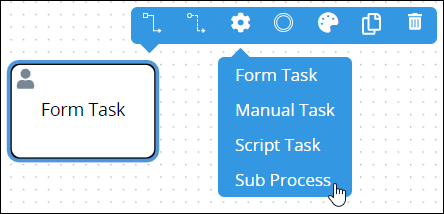
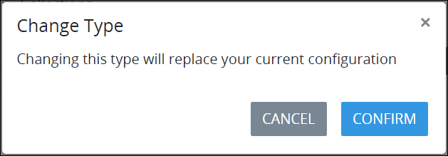
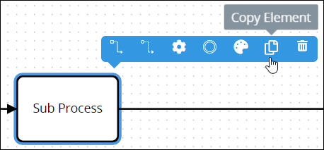
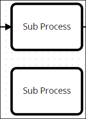
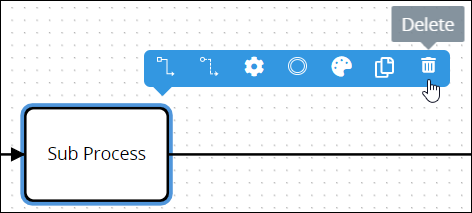
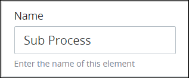
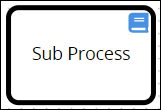

# Sub Process Element

## Permissions Required


### Don't Know What a Script Task Element Is?

See [Process Modeling Element Descriptions](process-modeling-element-descriptions.md) for a description of the [Script Task](process-modeling-element-descriptions.md#script-task) element.


Your ProcessMaker user account or group membership must have the following permissions to configure a Sub Process element in the Process model unless your user account has the **Make this user a Super Admin** setting selected:

* Processes: Edit Processes
* Processes: View Processes

See the [Process](../../../processmaker-administration/permission-descriptions-for-users-and-groups.md#processes) permissions or ask your ProcessMaker Administrator for assistance.

## Add a Sub Process Element


[Permissions are required to do this](add-and-configure-sub-process-elements.md#permissions-required).


Follow these steps to add a Sub Process element to the Process model:

1. [View your Processes](../../viewing-processes/view-the-list-of-processes/view-your-processes.md#view-all-active-processes). The **Processes** page displays.
2. [Create a new Process](../../viewing-processes/view-the-list-of-processes/create-a-process.md) or click the **Open Modeler** iconto edit the selected Process model. Process Modeler displays.
3. Locate the **Task** element in the **Elements and Connectors** palette that is to the left of the Process Modeler canvas. If the [**Hide Menus** button](../navigate-around-your-process-model.md#maximize-the-process-modeler-canvas-view)is enabled, the **Elements and Connectors** palette displays the **Task** element's icon.

   

4. Drag the element into the Process model canvas where you want to place it. If a Pool element is in your Process model, the Sub Process element cannot be placed outside of the Pool element.
5. From the **Elements** drop-down menu, select the **Sub Process** option. The Sub Process element displays.  


After adding the Sub Process element, consider adding any of the following Boundary-type Process model elements to design business solutions when your best-case scenarios don't happen:

* [Boundary Timer Event](add-and-configure-boundary-timer-event-elements.md#add-a-boundary-timer-event-element) element \([Don't know what that is?](process-modeling-element-descriptions.md#boundary-timer-event)\)
* [Boundary Error Event](add-and-configure-boundary-error-event-elements.md#add-a-boundary-error-event-element) element \([Don't know what that is?](process-modeling-element-descriptions.md#boundary-error-event)\)
* [Boundary Signal Event](add-and-configure-boundary-signal-event-elements.md) element \([Don't know what that is?](process-modeling-element-descriptions.md#boundary-signal-event)\)
* [Boundary Message Event](add-and-configure-boundary-message-event-elements.md#add-a-boundary-message-event-element) element \([Don't know what that is?](process-modeling-element-descriptions.md#boundary-message-event)\)


After the element is placed into the Process model, you may adjust its location in the following ways:

* Move the element by dragging it to a new location.
* [Select the element with other elements and/or connectors](../select-multiple-process-model-elements-and-connectors.md#select-multiple-process-model-objects), and then move them collectively by dragging them to new locations in relation to one another.
* [Align](../align-and-distribute-process-model-elements-and-connectors.md#align-process-model-objects) and/or [distribute](../align-and-distribute-process-model-elements-and-connectors.md#distribute-process-model-objects) the element in relation to other selected elements and/or [connectors](../model-processes-using-connectors/what-is-a-connector.md).


Moving a Sub Process element has the following limitations in regards to the following Process model elements:

* **Pool element:** If the Sub Process element is inside of a [Pool](process-modeling-element-descriptions.md#pool) element, it cannot be moved outside of the Pool element. If you attempt to do so, Process Modeler places the Sub Process element inside the Pool element closest to where you attempt to move it.
* **Lane element:** If the Sub Process element is inside of a Lane element, it can be moved to another Lane element in the same Pool element. However, the Sub Process element cannot be moved outside of the Pool element.


## Change the Color of a Sub Process Element

The Sub Process element and label are black-colored by default. After a Sub Process element is [added to a Process model](add-and-configure-sub-process-elements.md#add-a-sub-process-element), its shape and label color can be changed. Element and [connector](../model-processes-using-connectors/what-is-a-connector.md) colors may only be changed individually.


[Permissions are required to do this](add-and-configure-sub-process-elements.md#permissions-required).


Follow these steps to change the color and label for a Sub Process element:

1. [View your Processes](https://processmaker.gitbook.io/processmaker-4-community/-LPblkrcFWowWJ6HZdhC/~/drafts/-LRhVZm0ddxDcGGdN5ZN/primary/designing-processes/viewing-processes/view-the-list-of-processes/view-your-processes#view-all-processes). The **Processes** page displays.
2. Click the **Open Modeler** iconto edit the selected Process model. Process Modeler displays.
3. Select the Sub Process element to change its color. Available options display above the selected element.  
4. Click the **Open Color Palette** icon. The color palette displays.
5. Do one of the following:
   * **Select a color swatch:** Select one of the color swatches from the color palette. The Sub Process element and label change to that color.
   * **Specify a custom color:** Click theicon to display the color selector, and then select a color, enter the [Hex color code](https://www.color-hex.com/), or enter the red, green, blue, and alpha color values for the custom color. The Sub Process element and label change to that color.  
   * **Reset to the default color:** Click theicon to reset the Sub Process element and label to its default color.

## Replace a Sub Process Element with a Task Type Element

After a Sub Process element is [added to a Process model](add-and-configure-sub-process-elements.md#add-a-sub-process-element), you may replace it with a Task type element:

* [Form Task](process-modeling-element-descriptions.md#form-task) element
* [Manual Task](process-modeling-element-descriptions.md#manual-task) element
* [Script Task](process-modeling-element-descriptions.md#script-task) element

The selected Sub Process element is replaced by the default settings and color of the replacing element.


[Permissions are required to do this](add-and-configure-sub-process-elements.md#permissions-required).


Follow these steps to replace a Sub Process element with a Task type element:

1. ​[View your Processes](https://processmaker.gitbook.io/processmaker-4-community/-LPblkrcFWowWJ6HZdhC/~/drafts/-LRhVZm0ddxDcGGdN5ZN/primary/designing-processes/viewing-processes/view-the-list-of-processes/view-your-processes#view-all-processes). The **Processes** page displays.
2. Click the **Open Modeler** iconto edit the selected Process model. Process Modeler displays.
3. Select the Sub Process element to change to another element. Available options display above the selected element.
4. Click the **Elements** icon. The **Elements** drop-down menu displays the Task type elements and the Sub Process element.  
5. Select the element to replace the Sub Process element. The **Change Type** screen displays to confirm replacing the currently selected element.  
6. Click **Confirm**. The new element replaces the Sub Process element with its default settings and color.

## Copy a Sub Process Element

Copying a Sub Process element copies the original along with its current settings, making it easier and faster to continue designing without adding default elements or [connectors](../model-processes-using-connectors/what-is-a-connector.md) with their default settings.

The copied Sub Process element displays below the original. Any [Sequence Flow](process-modeling-element-descriptions.md#sequence-flow) and/or [Message Flow](process-modeling-element-descriptions.md#message-flow) elements incoming to or outgoing from the original are not copied.


[Permissions are required to do this](add-and-configure-sub-process-elements.md#permissions-required).


Follow these steps to copy a Sub Process element in your Process model:

1. ​[View your Processes](https://processmaker.gitbook.io/processmaker-4-community/-LPblkrcFWowWJ6HZdhC/~/drafts/-LRhVZm0ddxDcGGdN5ZN/primary/designing-processes/viewing-processes/view-the-list-of-processes/view-your-processes#view-all-processes). The **Processes** page displays.
2. Click the **Open Modeler** iconto edit the selected Process model. Process Modeler displays.
3. Select the Sub Process element to copy. Available options display above the selected element.  
4. Click the **Copy Element** icon. The Process model element copies.  

## Delete a Sub Process Element

Deleting a Process model element also deletes any [Sequence Flow](process-modeling-element-descriptions.md#sequence-flow) and/or [Message Flow](process-modeling-element-descriptions.md#message-flow) elements incoming to or outgoing from that element. For example, if a Process model element is deleted that has both incoming and outgoing Sequence Flow elements, the Sequence Flow elements must be reconnected for the remaining elements/[connectors](../model-processes-using-connectors/what-is-a-connector.md).


[Permissions are required to do this](add-and-configure-sub-process-elements.md#permissions-required).


Follow these steps to delete a Sub Process element from your Process model:

1. ​[View your Processes](https://processmaker.gitbook.io/processmaker-4-community/-LPblkrcFWowWJ6HZdhC/~/drafts/-LRhVZm0ddxDcGGdN5ZN/primary/designing-processes/viewing-processes/view-the-list-of-processes/view-your-processes#view-all-processes). The **Processes** page displays.
2. Click the **Open Modeler** iconto edit the selected Process model. Process Modeler displays.
3. Select the Sub Process element to delete. Available options display above the selected element.  
4. Click the **Delete** icon. The Process model element deletes.

## Settings

The Sub Process element has the following panels that contain settings:

* **Configuration** panel
  * [Edit the element name](add-and-configure-sub-process-elements.md#edit-the-element-name)
  * [Select the "child" Sub Process this element calls](add-and-configure-sub-process-elements.md#select-the-child-sub-process-this-element-calls)
* **Vocabularies** panel
  * [Assign ProcessMaker Vocabularies that validate Request data from this element](add-and-configure-sub-process-elements.md#assign-processmaker-vocabularies-that-validate-request-data-from-this-element)
* **Advanced** panel
  * [Edit the element's identifier value](add-and-configure-sub-process-elements.md#edit-the-elements-identifier-value)

### Configuration Panel Settings

#### Edit the Element Name

An element name is a human-readable reference for a Process element. Process Modeler automatically assigns the name of a Process element with its element type. However, an element's name can be changed.


[Permissions are required to do this](add-and-configure-sub-process-elements.md#permissions-required).


Follow these steps to edit the name for a Sub Process element:

1. Ensure that the **Hide Menus** buttonis not enabled. See [Maximize the Process Modeler Canvas View](../navigate-around-your-process-model.md#maximize-the-process-modeler-canvas-view).
2. Select the Sub Process element from the Process model in which to edit its name. Panels to configure this element display.
3. Expand the **Configuration** panel if it is not presently expanded. The **Name** setting displays. This is a required setting. 
4. In the **Name** setting, edit the selected element's name and then press **Enter**.

#### Select the "Child" Sub Process This Element Calls

The Sub Process element calls a Sub Process when it triggers. The Sub Process is referred to as a "child" Process, while the calling Process is referred to as the "parent" Process. The child Sub Process must in the same ProcessMaker instance as the parent Process and not [archived](../../viewing-processes/view-the-list-of-processes/remove-a-process.md).

The child Sub Process has its own [Request](../../../using-processmaker/requests/what-is-a-request.md). The Request for the parent Process waits until the child Sub Process's Request completes before its workflow continues. When the child Sub Process's Request completes, the parent Process's Request continues from the Sub Process element.


To prevent routing for the parent Process's Request from waiting until the child Sub Process's Request completes, use a [Parallel Gateway](process-modeling-element-descriptions.md#parallel-gateway) element preceding the Sub Process element. Use a parallel outgoing [Sequence Flow](the-quick-toolbar.md) element from the Parallel Gateway element to continue routing the parent Process while the Sub Process element waits for the child Sub Process's Request to complete.



[Permissions are required to do this](add-and-configure-sub-process-elements.md#permissions-required).


Follow these steps to select the child Sub Process the Sub Process element calls when it triggers:

1. Ensure that the **Hide Menus** buttonis not enabled. See [Maximize the Process Modeler Canvas View](../navigate-around-your-process-model.md#maximize-the-process-modeler-canvas-view).
2. Select the Sub Process element from the Process model in which to select the child Sub Process that element calls. Panels to configure this element display.
3. Expand the **Configuration** panel if it is not presently expanded, and then locate the **Process** setting. 
4. From the **Process** drop-down menu, select which child Sub Process the Sub Process element calls when it triggers.

### Vocabularies Panel Settings

#### Assign ProcessMaker Vocabularies That Validate Request Data from This Element

Assign [ProcessMaker Vocabularies](../../vocabularies-management/what-is-a-vocabulary.md) that validate that Request data complies with a specific JSON schema. This is often mandatory for many types of business sectors including banking and healthcare. Ensure the quality and compliance of Request data. For example, during a Loan Application process, ensure that personal information has been included in the Request to that moment in that in-progress Request. The Vocabularies package must be installed in your ProcessMaker instance to make this configuration.

Use a ProcessMaker Vocabulary on a Sub Process element to validate that Request data complies with the Vocabulary's JSON schema after routing returns from the child Sub Process's Request to the parent Process's Request, but prior to when the Request continues routing for the parent Request. See [What is a Vocabulary?](../../vocabularies-management/what-is-a-vocabulary.md) for more information.

Each moment ProcessMaker evaluates workflow routing for an in-progress Request, ProcessMaker also evaluates the Request data's conformity to the ProcessMaker Vocabularies applied to the Process and/or a specific BPMN 2.0 element in the Process model. The Request's JSON data model must conform to the ProcessMaker Vocabulary's JSON schema.

During an in-progress Request, if ProcessMaker evaluates that the Request data no longer complies with all ProcessMaker Vocabularies to that moment, the Request status changes from In Progress to Error. The error displays in the [Request summary](../../../using-processmaker/requests/request-details/summary-for-requests-with-errors.md). ProcessMaker Vocabularies are cumulative in an in-progress Request: as the Request progresses, if Request data does not conform with any Vocabulary's JSON schema to that moment in the Request, the Request errors.

If no ProcessMaker Vocabularies are assigned, ProcessMaker does not validate that Request data complies with a specific JSON schema prior to continuing workflow for that Request.

One or more ProcessMaker Vocabularies must be created to your ProcessMaker instance before assigning a Vocabulary. See [Create a New Vocabulary](../../vocabularies-management/manage-your-vocabularies/create-a-new-vocabulary.md#create-a-new-processmaker-vocabulary). Multiple ProcessMaker Vocabularies can be assigned to a Sub Process element.


### ProcessMaker Package Required

Your ProcessMaker instance must have the [Vocabularies package](../../../package-development-distribution/package-a-connector/vocabularies.md) installed to assign which ProcessMaker Vocabularies validate Request data at a Sub Process element. Use the Vocabularies package to maintain uniform JSON schemas across all assets in your organization. These assets include [Processes](../../viewing-processes/what-is-a-process.md), [ProcessMaker Screens](../../design-forms/what-is-a-form.md), and [ProcessMaker Scripts](../../scripts/what-is-a-script.md).

A ProcessMaker Vocabulary is a JSON schema. The JSON schema describes the data objects, types, and structure that you want in both a machine and human readable format. Apply one or more ProcessMaker Vocabularies to your Processes and/or specific BPMN 2.0 elements in your Process models to ensure the JSON data model in Request data complies with the data structure outlined in the JSON schema that you need to meet regulatory specifications or ensure Request data contains required information.

The Vocabularies package is not available in the ProcessMaker open-source edition. Contact [ProcessMaker Sales](mailto:sales@processmaker.com) or ask your ProcessMaker sales representative how the Vocabularies package can be installed in your ProcessMaker instance.



[Permissions are required to do this](add-and-configure-sub-process-elements.md#permissions-required).


Follow these steps to assign ProcessMaker Vocabularies that validate Request data from a Sub Process element:

1. Ensure that the **Hide Menus** buttonis not enabled. See [Maximize the Process Modeler Canvas View](../navigate-around-your-process-model.md#maximize-the-process-modeler-canvas-view).
2. Select the Sub Process element from the Process model in which to assign ProcessMaker Vocabularies that validate Request data prior to when this element completes. Panels to configure this element display.
3. Expand the **Vocabularies** panel if it is not presently expanded. The **Assigned** setting displays.
4. Click theicon to add a ProcessMaker Vocabulary. The **Assign Vocabulary** setting displays.  
5. From the **Select Vocabulary** drop-down menu, select a ProcessMaker Vocabulary from which to validate Request data complies with its JSON schema.

   If no ProcessMaker Vocabularies are configured in your ProcessMaker instance, then the following message displays: **List is empty.** Create at least one ProcessMaker Vocabulary. See [Create a New Vocabulary](../../vocabularies-management/manage-your-vocabularies/create-a-new-vocabulary.md#create-a-new-processmaker-vocabulary).

6. Click **Save**.
7. Repeat Steps 3 through 6 as necessary for each ProcessMaker Vocabulary required to validate Request data complies with its JSON schema.


Click the **Remove** iconfrom the **Vocabularies** setting to remove a ProcessMaker Vocabulary from assignment to this element.


After one or more ProcessMaker Vocabularies are assigned to a Sub Process element, the Vocabulary icon displays in that element.

### Advanced Panel Settings

#### Edit the Element's Identifier Value

Process Modeler automatically assigns a unique value to each Process element added to a Process model. However, an element's identifier value can be changed if it is unique to all other elements in the Process model, including the Process model's identifier value.


[Permissions are required to do this](add-and-configure-sub-process-elements.md#permissions-required).



All identifier values for all elements in the Process model must be unique.


Follow these steps to edit the identifier value for a Sub Process element:

1. Ensure that the **Hide Menus** buttonis not enabled. See [Maximize the Process Modeler Canvas View](../navigate-around-your-process-model.md#maximize-the-process-modeler-canvas-view).
2. Select the Sub Process element from the Process model in which to edit its identifier value. Panels to configure this element display.
3. Expand the **Advanced** panel if it is not presently expanded. The **Node Identifier** setting displays. This is a required setting. 
4. In the **Node Identifier** setting, edit the Sub Process element's identifier to a unique value from all elements in the Process model and then press **Enter**.

## Related Topics















