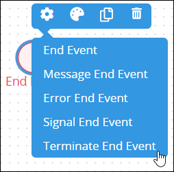
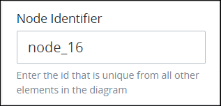

# Add and Configure Terminate End Event Elements

## Add a Terminate End Event Element


### Don't Know What a Terminate End Event Is?

See [Process Modeling Element Descriptions](process-modeling-element-descriptions.md) for a description of the [Terminate End Event](process-modeling-element-descriptions.md#terminate-end-event) element.

### Permissions Required

Your ProcessMaker user account or group membership must have the following permissions to add a Terminate End Event element to the Process model unless your user account has the **Make this user a Super Admin** setting selected:

* Processes: Edit Processes
* Processes: View Processes

See the [Process](../../../processmaker-administration/permission-descriptions-for-users-and-groups.md#processes) permissions or ask your ProcessMaker Administrator for assistance.


Follow these steps to add a Terminate End Event element to the Process model:

1. [View your Processes](../../viewing-processes/view-the-list-of-processes/view-your-processes.md#view-all-active-processes). The **Processes** page displays.
2. [Create a new Process](../../viewing-processes/view-the-list-of-processes/create-a-process.md) or click the **Open Modeler** iconto edit the selected Process model. Process Modeler displays.
3. Locate the **End Event** element in the **Elements and Connectors** palette that is to the left of the Process Modeler canvas. If the [**Hide Menus** button](../navigate-around-your-process-model.md#maximize-the-process-modeler-canvas-view)is enabled, the **Elements and Connectors** palette displays the **End Event** element's icon.

   

4. Drag the element into the Process model canvas where you want to place it. If a Pool element is in your Process model, the Terminate End Event element cannot be placed outside of the Pool element.
5. From the **Elements** drop-down menu, select the **Terminate End Event** option. The Terminate End Event element displays.  

After the element is placed into the Process model, you may move it by dragging it to the new location.


Moving a Terminate End Event element has the following limitations in regards to the following Process model elements:

* **Pool element:** If the Terminate End Event element is inside of a [Pool](process-modeling-element-descriptions.md#pool) element, it cannot be moved outside of the Pool element. If you attempt to do so, Process Modeler places the Terminate End Event element inside the Pool element closest to where you attempt to move it.
* **Lane element:** If the Terminate End Event element is inside of a Lane element, it can be moved to another Lane element in the same Pool element. However, the Terminate End Event element cannot be moved outside of the Pool element.


## Settings


Your ProcessMaker user account or group membership must have the following permissions to configure a Terminate End Event element unless your user account has the **Make this user a Super Admin** setting selected:

* Processes: Edit Processes
* Processes: View Processes

See the [Process](../../../processmaker-administration/permission-descriptions-for-users-and-groups.md#processes) permissions or ask your ProcessMaker Administrator for assistance.


The Terminate End Event element has the following panels that contain settings:

* **Configuration** panel
  * [Edit the element name](add-and-configure-terminate-end-event-elements.md#edit-the-element-name)
* **Advanced** panel
  * [Edit the element's identifier value](add-and-configure-terminate-end-event-elements.md#edit-the-elements-identifier-value)

### Configuration Panel Settings

#### Edit the Element Name

An element name is a human-readable reference for a Process element. Process Modeler automatically assigns the name of a Process element with its element type. However, an element's name can be changed.

Follow these steps to edit the name for a Terminate End Event element:

1. Ensure that the **Hide Menus** buttonis not enabled. See [Maximize the Process Modeler Canvas View](../navigate-around-your-process-model.md#maximize-the-process-modeler-canvas-view).
2. Select the Terminate End Event element from the Process model in which to edit its name. Panels to configure this element display.
3. Expand the **Configuration** panel if it is not presently expanded. The **Name** setting displays. This is a required setting.  
4. In the **Name** setting, edit the selected element's name and then press **Enter**.

### Advanced Panel Settings

#### Edit the Element's Identifier Value

Process Modeler automatically assigns a unique value to each Process element added to a Process model. However, an element's identifier value can be changed if it is unique to all other elements in the Process model, including the Process model's identifier value.


All identifier values for all elements in the Process model must be unique.


Follow these steps to edit the identifier value for a Terminate End Event element:

1. Ensure that the **Hide Menus** buttonis not enabled. See [Maximize the Process Modeler Canvas View](../navigate-around-your-process-model.md#maximize-the-process-modeler-canvas-view).
2. Select the Terminate End Event element from the Process model in which to edit its identifier value. Panels to configure this element display.
3. Expand the **Advanced** panel if it is not presently expanded. The **Node Identifier** setting displays. This is a required setting.  
4. In the **Node Identifier** setting, edit the Terminate End Event element's identifier to a unique value from all elements in the Process model and then press **Enter**.

## Related Topics











