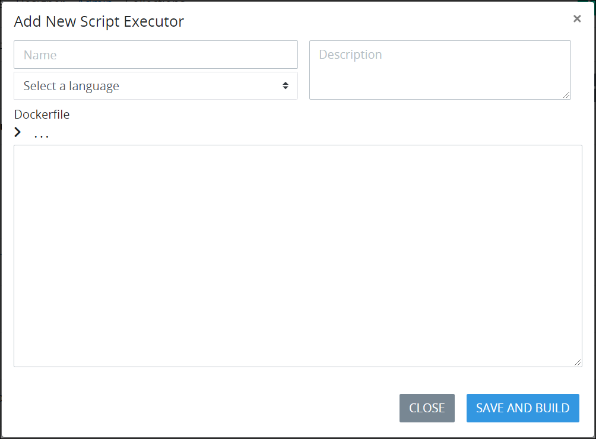

# Create a New Script Executor

## Create a New ProcessMaker Script Executor

To create a new ProcessMaker Script Executor is to build a new [Docker container](https://www.docker.com/resources/what-container) using a [supported ProcessMaker programming language](../what-is-a-script-executor.md#supported-programming-languages) from which the ProcessMaker Script Executor runs [ProcessMaker Scripts](../../../designing-processes/scripts/what-is-a-script.md).

Follow these steps to create a new ProcessMaker Script Executor:

1. [View your ProcessMaker Script Executors](view-script-executors.md#view-all-processmaker-script-executors). The **Script Executors** page displays.
2. Click the **+Script Executor** button. The **Add New Script Executor**
    screen displays.  
3. In the **Name** setting, enter the unique name for the ProcessMaker Script Executor. This name displays from ProcessMaker Script configuration settings, so enter a descriptive name that ProcessMaker designers configuring their ProcessMaker Scripts understand what customization this Script Executor provides. For example, if specific third-party classes have been appended to the ProcessMaker Script Executor that provide access to that third-party's API or SDK, enter a name that ProcessMaker designers developing their Scripts understand how they can best use this Script Executor.
4. In the **Description** setting, enter a description for the ProcessMaker Script Executor.
5. From the **Language** setting, select one of the following programming languages that the ProcessMaker Script Executor uses to run ProcessMaker Scripts:

   * PHP
   * Lua
   * JavaScript
   * C\# \(requires the [C\# package](../../../package-development-distribution/package-a-connector/c-package.md) in your ProcessMaker instance\)
   * Java \(requires the [Java package](../../../package-development-distribution/package-a-connector/java-package.md) in your ProcessMaker instance\)
   * Python \(requires the [Python package](../../../package-development-distribution/package-a-connector/python-package.md) in your ProcessMaker instance\)
   * R \(requires the [R package](../../../package-development-distribution/package-a-connector/r-package.md) in your ProcessMaker instance\)

   After selecting a programming language, the default [Dockerfile](https://docs.docker.com/engine/reference/builder/#:~:text=A%20Dockerfile%20is%20a%20text,can%20use%20in%20a%20Dockerfile%20.) content to run ProcessMaker Scripts using that language displays in the **Dockerfile** setting. The Dockerfile content includes the ProcessMaker SDK for that language.

6. From the **Dockerfile** setting, append the default Dockerfile content with the [Docker commands](https://docs.docker.com/engine/reference/commandline/docker/) the ProcessMaker Script Executor runs when it builds the Docker container. Consider following [best practices for writing Dockerfiles](https://docs.docker.com/develop/develop-images/dockerfile_best-practices/). Do not edit the default Dockerfile content as this is necessary to run ProcessMaker Scripts successfully in a Docker container using the selected programming language.
7. Click **Save and Build** to build the Docker container from which the ProcessMaker Script Executor runs Scripts. The **Build Command Output** setting displays below the **Dockerfile** setting as the ProcessMaker Script Executor builds the Docker container in real-time. If the Docker container builds successfully, the following message displays: **Executor Successfully Built. You can now close this window**. If building the Docker container is unsuccessful, the following message displays: **Error Building Executor. See Output Above.**. The **Build Command Output** setting displays the Dockerfile error.
8. Click **Close**.

## Video Demonstration

See an example in the following video how to use a ProcessMaker Script Executor that includes a Docker RUN command to package the Google Client class provided by Google into that Script Executor, thereby allowing ProcessMaker Scripts using that Script Executor to successfully call the Google API.

* **Intended audience:** ProcessMaker Administrators, software developers, and coding engineers
* **Viewing time:** 3 minutes; contains narration



## Related Topics











