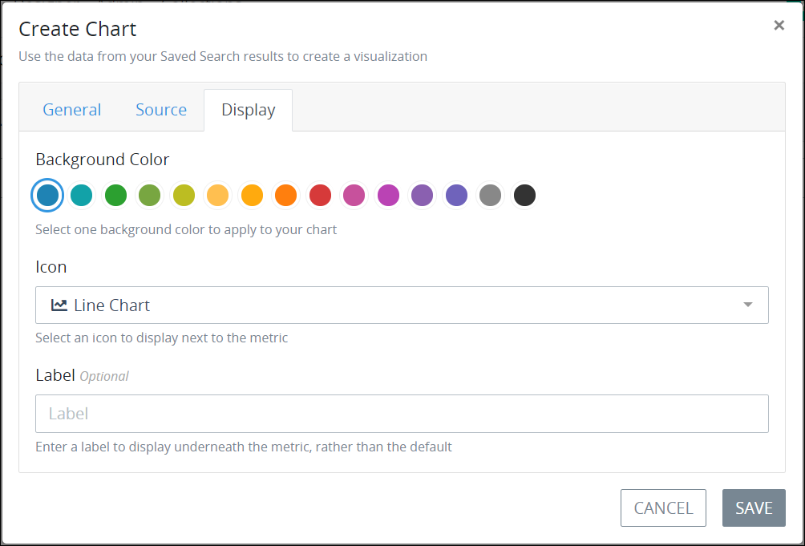
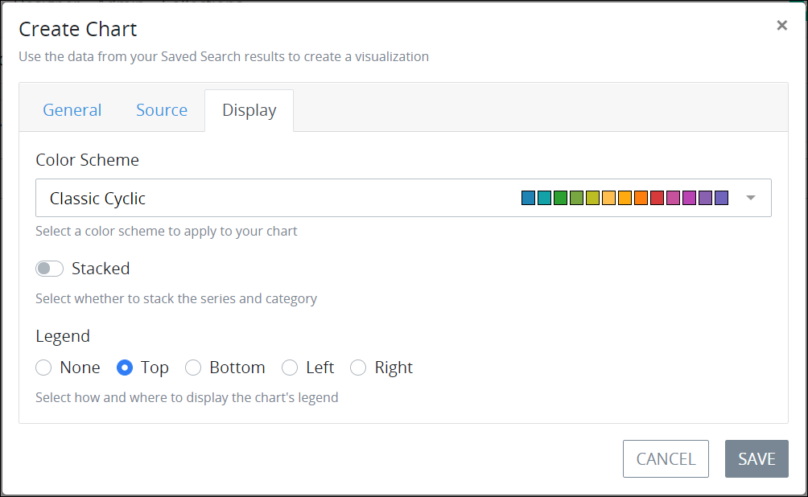

# Create a Saved Search Chart

## Create a Saved Search Chart


### ProcessMaker Package Required

To create a chart for a [Saved Search's](../what-is-a-saved-search.md) results, the [Saved Searches package](../../../package-development-distribution/package-a-connector/saved-searches-package.md) must be installed in your ProcessMaker instance. The Saved Searches package is not available in the ProcessMaker open-source edition. Contact [ProcessMaker Sales](mailto:sales@processmaker.com) or ask your ProcessMaker sales representative how the Saved Searches package can be installed in your ProcessMaker instance.


Follow these steps to create a chart for a type of Saved Search:

1. [View the search results for a Saved Search](../view-saved-searches-that-are-shared-with-you/view-search-results-for-a-saved-search.md) in which to create a chart. The **Data** tab displays the data details for that Saved Search.
2. Click the **Charts** tab. The **Charts** tab displays all charts already created for this Saved Search.
3. Click the **+Chart** button. The **Create Chart** screen displays the **General** tab.  
4. In the **Name** setting, enter the name of the chart. This is a required setting.
5. From the **Chart Type** group, select one of the following chart types to visualize the results of this Saved Search:

   * **Bar \(Horizontal\):** The horizontal-style bar chart visualizes Saved Search results in horizontal bars. See [chart example](overview-of-saved-search-charts.md#bar-chart-horizontal).
   * **Bar \(Vertical\):** The vertical-style bar chart visualizes Saved Search results in vertical bars. See [chart example](overview-of-saved-search-charts.md#bar-chart-vertical).
   * **Line:** The line chart visualizes Saved Search results as data points on a line to show how those results trend. See [chart example](overview-of-saved-search-charts.md#line-chart).
   * **Pie:** The pie chart visualizes Saved Search results as relational proportions between data. See [chart example](overview-of-saved-search-charts.md#pie-chart).
   * **Doughnut:** The doughnut chart visualizes Saved Search results as relational proportions between data similarly to the pie chart type but with the inner portion removed. See [chart example](overview-of-saved-search-charts.md#doughnut-chart).
   * **Count:** The count chart displays a single data metric on a canvas. See [chart example](overview-of-saved-search-charts.md#count).

   **Bar \(Horizontal\)** is the default chart type.

6. Click the **Source** tab to configure from which Saved Search's results to visualize in the chart.  
7. From the **Series** setting, select how to group the chart data. The [series](overview-of-saved-search-charts.md#series) groups the chart content by the units of measurement in the X-axis for applicable chart types. See [chart example that references the series grouping](overview-of-saved-search-charts.md#example-chart). The **Series** setting does not apply to count charts. Options that display in the **Series** drop-down menu derive from the columns configured from the Saved Search tabular data as displayed from the **Data** tab of this Saved Search. The default configurable columns vary for each type of Saved Search. The **Recommended** indicator for Saved Search results represent dates, numbers, and/or unique text results and are recommended when configuring the chart series. This is a required setting for applicable charts.
8. From the **Category** setting, optionally select a secondary measurement by which to aggregate the chart series. See [chart example that references the category measurement](overview-of-saved-search-charts.md#example-chart). The **Category** setting does not apply to count charts. Options and their recommendations that display in the **Category** setting are the same as those in the **Series** setting.
9. From the **Metric** setting, select the chart contents from the Saved Search tabular-formatted results to aggregate as well as how to aggregate that data. The **Metric** setting options are numerically-based Saved Search results such as **\#** that represents the ID for the Request, Task, or ProcessMaker Collection record associated with that Saved Search. See [chart example that references how that chart data is aggregated](overview-of-saved-search-charts.md#example-chart). This is a required setting.
10. In the **Query** setting, optionally enter a ProcessMaker Query Language \(PMQL\) query from which to further filter the Saved Search's results. See the following topics for information how to use PMQL for Requests, Tasks, and ProcessMaker Collections:
    * [PMQL Syntax for Requests](../../search-processmaker-data-using-pmql.md#pmql-syntax-for-requests)
    * [PMQL Syntax for Tasks](../../search-processmaker-data-using-pmql.md#pmql-syntax-for-tasks)
    * [PMQL Syntax for ProcessMaker Collections](../../search-processmaker-data-using-pmql.md#pmql-syntax-for-processmaker-collections)
11. Click the **Display** tab to configure the appearance and style of the Saved Search chart. The **Display** tab settings vary depending on the chart type selected from the **General** tab.

    **Display tab settings for the count chart type**  
     

    1. 2. 
    **Display tab settings for all chart types except the count chart**  
     

    1. 

12. Click **Save**.

## Related Topics

